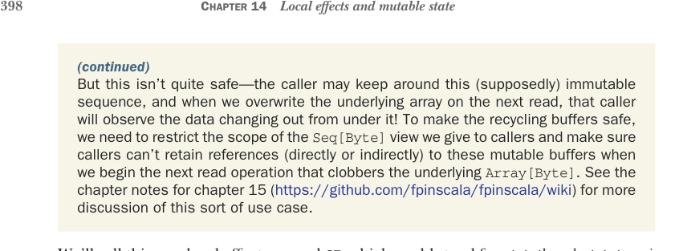

# Page 0427

[<- Page 0426](./page-0426) | [Pages index](./) | [Page 0428 ->](./page-0428)

> Part 4: Effects and I/O / Chapter 14: Local effects and mutable state / 14.2 A data type to enforce the scoping of side effects / 14.2.2 An algebra of mutable references



### (continued) But this isn’t quite safe—the caller may keep around this (supposedly) immutable sequence, and when we overwrite the underlying array on the next read, that caller will observe the data changing out from under it! To make the recycling buffers safe, we need to restrict the scope of the Seq[Byte] view we give to callers and make sure callers can’t retain references (directly or indirectly) to these mutable buffers when we begin the next read operation that clobbers the underlying Array[Byte]. See the chapter notes for chapter 15 (https://github.com/fpinscala/fpinscala/wiki) for more discussion of this sort of use case.

We’ll call this new local-effects monad `ST`, which could stand for *state thread*, *state transi-*tion*, *state token*, or *state tag*. It’s different from the `State` monad in that there’s no way of directly calling the underlying function, but otherwise, its structure is exactly the same.

Listing 14.2 Our new `ST` data type

```scala
opaque type ST[S, A] = S => (A, S)
object ST:
extension [S, A](self: ST[S, A])
def map[B](f: A => B): ST[S, B] =
s =>
val (a, s1) = self(s)
(f(a), s1)
```


```scala
def flatMap[B](f: A => ST[S, B]): ST[S, B] =
s =>
val (a, s1) = self(s)
f(a)(s1)
```

> Cache the value in case the returned ST is run more than once.

```scala
def apply[S, A](a: => A): ST[S, A] =
lazy val memo = a
s => (memo, s)
def lift[S, A](f: S => (A, S)): ST[S, A] = f
```

There’s no mechanism provided for directly invoking the underlying function because an `S` represents the ability to mutate state, and we don’t want the mutation to escape. So how do we run an `ST` action, giving it an initial state? This question is actually two separate questions. We’ll start by answering the question of how we specify the initial state. As we explore the `ST` type, keep in mind that it’s not necessary to understand every detail of the implementation. What matters is the idea that we can use the type system to constrain the scope of mutable state.

### 14.2.2 An algebra of mutable references

Our first example of an application for the `ST` monad is a little language for talking about mutable references. This language takes the form of a combinator library with

[<- Page 0426](./page-0426) | [Pages index](./) | [Page 0428 ->](./page-0428)
