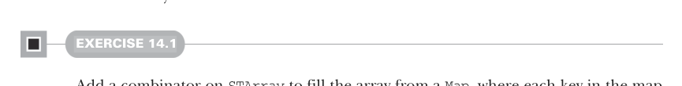

# Page 0432

[<- Page 0431](./page-0431) | [Pages index](./) | [Page 0433 ->](./page-0433)

> Part 4: Effects and I/O / Chapter 14: Local effects and mutable state / 14.2 A data type to enforce the scoping of side effects / 14.2.4 Mutable arrays

## 403 14.2 A data type to enforce the scoping of side effects

Listing 14.3 An array class for our `ST` monad

```scala
final class STArray[S, A] private (private var value: Array[A]):
```


```scala
def size: ST[S, Int] = ST(value.size)
```

> Write a value at the given index of the array.

```scala
def write(i: Int, a: A): ST[S, Unit] =
ST.lift[S, Unit]:
s =>
value(i) = a
((), s)
```

> Read the value at the given index of the array.

```scala
def read(i: Int): ST[S, A] = ST(value(i))
def freeze: ST[S, List[A]] = ST(value.toList)
```

> Turn the array into an immutable list.

```scala
object STArray:
def apply[S, A: ClassTag](
sz: Int, v: A
): ST[S, STArray[S, A]] =
```

> Construct an array of the given size filled with the value v.

```scala
ST(new STArray[S, A](Array.fill(sz)(v)))
```

Note that Scala can’t create arrays for every type `A`. It requires a given `ClassTag[A]` instance existing in scope, which we provide here via the `A:` `ClassTag` context bound. Scala’s standard library provides class tags for various concrete types. As with `STRef`, we always return an `STArray` packaged in an `ST` action with a corresponding `S` type, and any manipulation of the array (even reading it) is an `ST` action tagged with the same type `S`. It’s therefore impossible to observe a naked `STArray` outside of the `ST` monad (except by code in the Scala source file in which the `STArray` data type itself is declared). Using these primitives, we can write more complex functions on arrays.



#### EXERCISE 14.1

Add a combinator on `STArray` to fill the array from a `Map`, where each key in the map represents an index into the array, and the value under that key is written to the array at that index. For example, `xs.fill(Map(0->"a",` `2->"b"))` should write the value `"a"` at index `0` in the array `xs` and `"b"` at index `2`. Use the existing combinators to write your implementation:

```scala
def fill(xs: Map[Int, A]): ST[S, Unit]
```

Not everything can be done efficiently using these existing combinators. For example, the Scala library already has an efficient way of turning a list into an array. Let’s make that a primitive as well:

[<- Page 0431](./page-0431) | [Pages index](./) | [Page 0433 ->](./page-0433)
