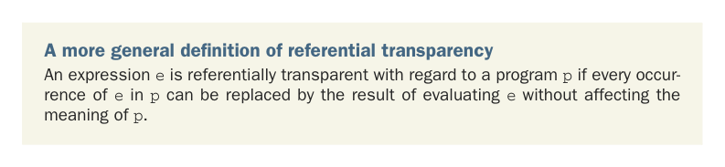

# Page 0434

[<- Page 0433](./page-0433) | [Pages index](./) | [Page 0435 ->](./page-0435)

> Part 4: Effects and I/O / Chapter 14: Local effects and mutable state / 14.3 Purity is contextual

## 405 14.3 Purity is contextual

### 14.3 Purity is contextual

In the preceding section, we talked about effects that aren’t observable because they’re entirely local to some scope. A program can’t observe mutation of data unless it holds a reference to that data. But there are other effects that may be unobservable, depending on who’s looking. As a simple example, let’s take a kind of side effect that occurs all the time in ordinary Scala programs, even ones we’d usually consider purely functional:

```scala
scala> case class Foo(s: String)
scala> val b = Foo("hello") == Foo("hello")
val b: Boolean = true
scala> val c = Foo("hello") eq Foo("hello")
val c: Boolean = false
```

Here `Foo("hello")` looks pretty innocent; we could be forgiven if we assumed it was a completely referentially transparent expression. But each time it appears, it produces a different `Foo`, in a certain sense. If we test two appearances of `Foo("hello")` for equality using the `==` function, we get `true`, as we’d expect. But when testing for *reference equal-*ity* (a notion inherited from the Java language) with `eq`, we get `false`. The two appearances of `Foo("hello")` aren’t references to the same object if we look under the hood. Note that if we evaluate `Foo("hello")` and store the result as `x` and then substitute `x` to get the expression `x` `eq` `x`, it has a different result:

```scala
scala> val x = Foo("hello")
val x: Foo = Foo(hello)
scala> val d = x eq x
val d: Boolean = true
```

Therefore, by our original definition of referential transparency, every data constructor in Scala has a side effect. The effect is that a new and unique object is created in memory, and the data constructor returns a reference to that new object. For most programs, this makes no difference because most programs don’t check for reference equality. It’s only the `eq` method that allows our programs to observe this side effect occurring. We could therefore say that it’s not a side effect at all for the vast majority of programs. Our definition of referential transparency doesn’t take this into account. Referential transparency is with regard to some context, and our definition doesn’t establish this context.



A more general definition of referential transparency An expression `e` is referentially transparent with regard to a program `p` if every occurrence of `e` in `p` can be replaced by the result of evaluating `e` without affecting the meaning of `p`.

[<- Page 0433](./page-0433) | [Pages index](./) | [Page 0435 ->](./page-0435)
