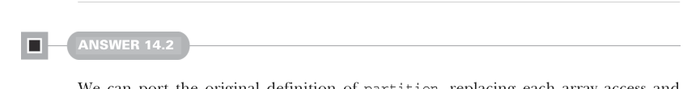

# Page 0437

[<- Page 0436](./page-0436) | [Pages index](./) | [Page 0438 ->](./page-0438)

> Part 4: Effects and I/O / Chapter 14: Local effects and mutable state / 14.5 Exercise answers

### Summary

Unobservable mutation is a completely valid implementation technique in functional programming.

Scala’s type system is expressive enough to track many types of effects.

The `ST` data type allows us to track the effect of the mutation of some shared state within some locally defined scope.

The `STRef` data type provides the ability to allocate, read, and write a mutable cell.

The `STArray` data type provides the ability to allocate, read, and write a mutable array.

Both `STRef` and `STArray` return `ST` actions for every access and mutation, ensuring access is limited to the same `ST` action.

Choosing which effects to track is a judgment call based on the needs of the program; track those effects that program correctness depends on.


### 14.5 Exercise answers

#### ANSWER 14.1

Let’s fold over the elements of the map, using the `write` operation on `STArray` to set the value at each index. To start the fold, we lift a unit value into `ST`:

```scala
def fill(xs: Map[Int, A]): ST[S, Unit] =
xs.foldRight(ST[S, Unit](())):
case ((k, v), st) => st.flatMap(_ => write(k, v))
```



#### ANSWER 14.2

We can port the original definition of `partition`, replacing each array access and update with the equivalent operation on `STArray`. The original definition used a `var` `j`, which we can replace with an `STRef`:

```scala
def partition[S](
a: STArray[S, Int], l: Int, r: Int, pivot: Int
): ST[S, Int] =
for
vp <- a.read(pivot)
_ <- a.swap(pivot, r)
j <- STRef(l)
_ <- (l until r).foldLeft(ST[S, Unit](()))((s, i) =>
for
_ <- s
vi <- a.read(i)
_
<- if vi < vp then
```

[<- Page 0436](./page-0436) | [Pages index](./) | [Page 0438 ->](./page-0438)
