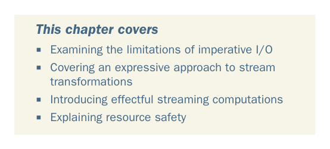

# Page 0439

[<- Page 0438](./page-0438) | [Pages index](./) | [Page 0440 ->](./page-0440)

> Part 4: Effects and I/O / Chapter 15: Stream processing and incremental I/O

## Stream processing and

*incremental I/O*

### This chapter covers

Examining the limitations of imperative I/O

Covering an expressive approach to stream transformations

Introducing effectful streaming computations

Explaining resource safety

We mentioned in the introduction to part 4 that functional programming is a complete paradigm. Every imaginable program can be expressed functionally, including programs that interact with the external world—but it would be disappointing if the `IO` type were the only way of constructing such programs. `IO` and `ST` work by simply embedding an imperative programming language into the purely functional subset of Scala. While programming within the `IO` monad, we have to reason about our programs, much like we would in ordinary imperative programming. We can do better. In this chapter, we’ll show how to recover the high-level compositional style developed in parts 1–3 of this book, even for programs that interact with the outside world. The design space in this area is enormous, and our goal

**410**

[<- Page 0438](./page-0438) | [Pages index](./) | [Page 0440 ->](./page-0440)
