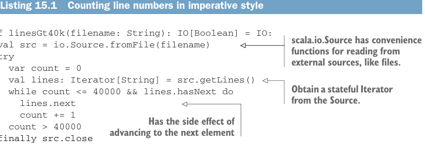

# Page 0440

[<- Page 0439](./page-0439) | [Pages index](./) | [Page 0441 ->](./page-0441)

> Part 4: Effects and I/O / Chapter 15: Stream processing and incremental I/O / 15.1 Problems with imperative I/O: An example

## 411 15.1 Problems with imperative I/O: An example

here is not to explore it completely but to convey ideas and give you a sense of what’s possible. We’ll build up a compositional streaming API that’s similar to the Functional Streams for Scala (FS2) library (https://fs2.io).

### 15.1 Problems with imperative I/O: An example

We’ll start by considering a simple concrete usage scenario, which we’ll use to highlight some of the problems with imperative I/O embedded in the `IO` monad. Our first challenge in this chapter is writing a program that checks whether the number of lines in a file is greater than 40,000. This is a deliberately simple task that illustrates the essence of the problem our library is intended to solve. We could certainly accomplish this task with ordinary imperative code inside the `IO` monad. Let’s look at that first.

Listing 15.1 Counting line numbers in imperative style



```scala
def linesGt40k(filename: String): IO[Boolean] = IO:
val src = io.Source.fromFile(filename)
try
var count = 0
val lines: Iterator[String] = src.getLines()
while count <= 40000 && lines.hasNext do
lines.next
count += 1
count > 40000
finally src.close
```

> scala.io.Source has convenience functions for reading from external sources, like files.

> Obtain a stateful Iterator from the Source.

> Has the side effect of advancing to the next element

We can then run this `IO` action with `linesGt40k("lines.txt").unsafeRunSync()`, where `unsafeRunSync` is a side-effecting method that takes `IO[A]`, returning `A` and actually performing the desired effects (see section 13.7.1). Although this code uses low-level primitives, like a `while` loop, mutable `Iterator`, and `var`, there are some good things about it. First, it’s incremental—the entire file isn’t loaded into memory up front. Instead, lines are fetched from the file only when needed. If we didn’t buffer the input, we could keep as little as a single line of the file in memory at a time. It also terminates early—as soon as the answer is known. There are some bad things about this code, too. For one, we have to remember to close the file when we’re done. This might seem obvious, but if we forget to do this, or (more commonly) if we close the file outside of a `finally` block and an exception occurs first, the file will remain open.1 This is called a *resource leak*. A file handle is an example of a scarce resource, since the operating system can only have a limited number of files open at any given time. If this task were part of a larger program—say we were scanning an entire directory recursively, building up a list of all files with more than 40,000 lines—our larger program could easily fail because too many files were left open.

1 The JVM will actually close an `InputStream` (which is what backs a `scala.io.Source`) when it’s garbage collected, but there’s no way of guaranteeing this will occur in a timely manner, or at all! This is especially true in generational garbage collectors that perform full collections infrequently.

[<- Page 0439](./page-0439) | [Pages index](./) | [Page 0441 ->](./page-0441)
