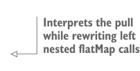

# Page 0443

[<- Page 0442](./page-0442) | [Pages index](./) | [Page 0444 ->](./page-0444)

> Part 4: Effects and I/O / Chapter 15: Stream processing and incremental I/O / 15.2 Simple stream transformations

### 15.2 Simple stream transformations

Our first step toward recovering the high-level style we’re accustomed to from `Lazy-` `List` and `List` while doing I/O is introducing the notion of *stream processors*. A stream processor specifies a transformation from one stream to another. We’re using the term *stream* quite generally here to refer to a sequence, possibly lazily generated or supplied by an external source. This could be a stream of lines from a file, HTTP requests, mouse click positions, or anything else. Let’s consider a simple data type, `Pull`, that lets us express stream transformations.3

Listing 15.2 The `Pull` data type

```scala
enum Pull[+O, +R]:
case Result[+R](result: R) extends Pull[Nothing, R]
case Output[+O](value: O) extends Pull[O, Unit]
case FlatMap[X, +O, +R](
source: Pull[O, X],
f: X => Pull[O, R]) extends Pull[O, R]
```



> Interprets the pull while rewriting left nested flatMap calls

```scala
def step: Either[R, (O, Pull[O, R])] = this match
case Result(r) => Left(r)
case Output(o) => Right(o, Pull.done)
case FlatMap(source, f) =>
source match
case FlatMap(s2, g) =>
s2.flatMap(x => g(x).flatMap(y => f(y))).step
case other => other.step match
case Left(r) => f(r).step
case Right((hd, tl)) => Right((hd, tl.flatMap(f)))
```


> Steps the pull until a final result is produced, accumulating an output value

```scala
@annotation.tailrec
final def fold[A](init: A)(f: (A, O) => A): (R, A) =
step match
case Left(r) => (r, init)
case Right((hd, tl)) => tl.fold(f(init, hd))(f)
```


```scala
def toList: List[O] =
fold(List.newBuilder[O])((bldr, o) => bldr += o)(1).result
```

> Folds the pull, collecting all output elements into a single list, and discards the R value

```scala
def flatMap[O2 >: O, R2](
f: R => Pull[O2, R2]
): Pull[O2, R2] =
Pull.FlatMap(this, f)
```

> Operates on the final result value of a pull, not each output value

```scala
def >>[O2 >: O, R2](next: => Pull[O2, R2]): Pull[O2, R2] =
flatMap(_ => next)
def map[R2](f: R => R2]): Pull[O, R2] =
```


```scala
flatMap(r => Result(f(r)))
```

3 We’ve chosen to omit some trampolining in this chapter for simplicity.

[<- Page 0442](./page-0442) | [Pages index](./) | [Page 0444 ->](./page-0444)
