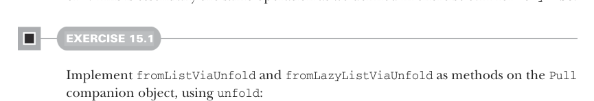
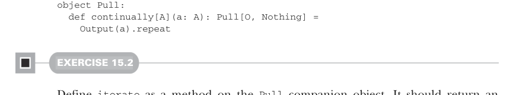

# Page 0445

[<- Page 0444](./page-0444) | [Pages index](./) | [Page 0446 ->](./page-0446)

> Part 4: Effects and I/O / Chapter 15: Stream processing and incremental I/O / 15.2 Simple stream transformations / 15.2.1 Creating pulls

evaluation to construct lazy lists in chapter 5, but here we’re relying on the laziness of `flatMap` to defer the evaluation of the tail. Let’s generalize this recursion pattern into a higher-level pull constructor:

```scala
def unfold[O, R](init: R)(f: R => Either[R, (O, R)]): Pull[O, R] =
f(init) match
case Left(r) => Result(r)
case Right((o, r2)) => Output(o) >> unfold(r2)(f)
```

`unfold` starts with an initial seed value of type `R` and an iteration function, which is repeatedly invoked, producing either a final result of `R` or an output of `O` and a new seed of `R`. This is essentially the same operation as we defined in exercise 5.11 for `LazyList`.



#### EXERCISE 15.1

Implement `fromListViaUnfold` and `fromLazyListViaUnfold` as methods on the `Pull` companion object, using `unfold`:

```scala
def fromListViaUnfold[O](os: List[O]): Pull[O, Unit]
def fromLazyListViaUnfold[O](os: LazyList[O]): Pull[O, Unit]
```

Like we did for `LazyList`, we can create a `continually` constructor:

```scala
def continually[A](a: A): Pull[A, Nothing] =
Output(a) >> continually(a)
```

The return type of `continually` is interesting—the result type is `Nothing`, since the pull is infinite and hence never terminates in a value. We can again extract the recursion out into a more general combinator:

```scala
enum Pull[+O, +R]:
def repeat: Pull[O, R] =
this >> repeat
```



```scala
object Pull:
def continually[A](a: A): Pull[O, Nothing] =
Output(a).repeat
```

#### EXERCISE 15.2

Define `iterate` as a method on the `Pull` companion object. It should return an infinite stream which first outputs the supplied initial value, then outputs the result of applying that value to the supplied function, and so on:

```scala
def iterate[O](initial: O)(f: O => O): Pull[O, Nothing]
```

[<- Page 0444](./page-0444) | [Pages index](./) | [Page 0446 ->](./page-0446)
