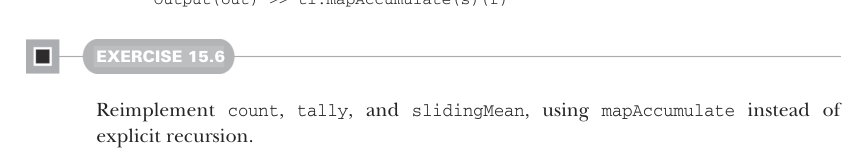

# Page 0448

[<- Page 0447](./page-0447) | [Pages index](./) | [Page 0449 ->](./page-0449)

> Part 4: Effects and I/O / Chapter 15: Stream processing and incremental I/O / 15.2 Simple stream transformations / 15.2.1 Creating pulls

## 419 15.2 Simple stream transformations

Just as we’ve seen many times throughout this book, when we notice common patterns when defining a series of functions, we can factor these patterns out into generic combinators. The functions `count`, `tally`, and `slidingMean` all share a common pattern: each has a single piece of state, has a state transition function that updates this state in response to input, and produces a single output. We can generalize this to a combinator, which we’ll call `mapAccumulate`:

```scala
def mapAccumulate[S, O2](init: S)(f: (S, O) => (S, O2)): Pull[O2, (S, R)] =
uncons.flatMap:
case Left(r) => Result((init, r))
case Right((hd, tl)) =>
val (s, out) = f(init, hd)
Output(out) >> tl.mapAccumulate(s)(f)
```



#### EXERCISE 15.6

Reimplement `count`, `tally`, and `slidingMean`, using `mapAccumulate` instead of explicit recursion.

THE PULL MONAD The `flatMap` operation along with the `Result` constructor form a monad instance for `[x]` `=>>` `Pull[O,` `x]`:

```scala
given [O]: Monad[[x] =>> Pull[O, x]] with
def unit[A](a: => A): Pull[O, A] = Result(a)
extension [A](pa: Pull[O, A])
def flatMap[B](f: A => Pull[O, B]): Pull[O, B] =
pa.flatMap(f)
```

We can create an alternative monad instance by taking `Output` as the implementation of `unit` and coming up with a different implementation of `flatMap`. `Output(a)` gives us a `Pull[A,` `Unit]`—the result type is `Unit`—so let’s define a `Monad[[x]` `=>>` `Pull[x,` `Unit]]`. By plugging in this type to the definition of `Monad` and following the types, we find we need to define a version of `flatMap` with the following signature:

```scala
extension [O](self: Pull[O, Unit])
def flatMap[O2](f: O => Pull[O2, Unit]): Pull[O2, Unit]
```

Notice that the function passed to `flatMap` takes an output from the original `Pull`. This suggests that our `flatMap` implementation will be similar to the monads for `List` and `LazyList`, where the supplied function is invoked on each output element and the results are all concatenated. Since we already have a `flatMap` method on `Pull`, let’s rename this extension to `flatMapOutput` and implement this map-then-concat behavior:

[<- Page 0447](./page-0447) | [Pages index](./) | [Page 0449 ->](./page-0449)
