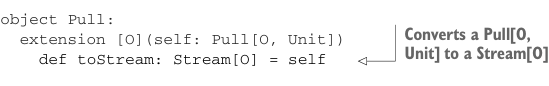

# Page 0450

[<- Page 0449](./page-0449) | [Pages index](./) | [Page 0451 ->](./page-0451)

> Part 4: Effects and I/O / Chapter 15: Stream processing and incremental I/O / 15.2 Simple stream transformations / 15.2.2 Composing stream transformations

## 421 15.2 Simple stream transformations

```scala
def fold[A](init: A)(f: (A, O) => A): A =
self.fold(init)(f)(1)
def toList: List[O] =
self.toList
def take(n: Int): Stream[O] =
self.take(n).void
def ++(that: => Stream[O]): Stream[O] =
self >> that
given Monad[Stream] with
def unit[A](a: => A): Stream[A] = Pull.Output(a)
extension [A](sa: Stream[A])
def flatMap[B](f: A => Stream[B]): Stream[B] =
sa.flatMapOutput(f)
```



```scala
object Pull:
extension [O](self: Pull[O, Unit])
```

> Converts a Pull[O, Unit] to a Stream[O]

```scala
def toStream: Stream[O] = self
```

Besides the opaque type definition and the monad instance, we’ve provided some additional APIs. The `toPull` and `toStream` methods allow us to convert back and forth between `Stream` and `Pull`. We’ve also provided some APIs for working directly with streams, delegating to the corresponding operations on `Pull` but adjusting the return type when necessary. For example, the `take` operation on `Stream` returns a `Stream[O]`, discarding the `Option[R]` result provided by `take` on `Pull`. Another interesting example is the `++` operation, which concatenates two streams using monadic sequencing of the underlying pulls. Do we need both `Pull` and `Stream`? `Pull` is more powerful than `Stream` (implied by the fact that `Stream` fixes the result type to `Unit`), so why not just stick with `Pull` and simply not provide the problematic monad instance? `Stream` is often the more convenient type to work with, modeling streaming computations as a collection like `LazyList`, whereas `Pull` excels at defining custom streaming computations in terms of `uncons` and `flatMap`. We can appeal to these strengths when designing the APIs of `Pull` and `Stream`—adding high-level, collection-like combinators directly to `Stream`, while adding operations that simplify building new streaming computations to `Pull`.

### 15.2.2 Composing stream transformations

The `Pull` type lets us describe arbitrarily complex data sources in terms of monadic recursion, and the `Stream` type provides us a collection like API that operates on the individual elements being output by a pull. The various stream transformations we’ve defined so far have all been methods on `Pull` or `Stream`. We’d like to be able to define stream transformations independent from the stream itself and compose multiple stream transformations into a single value. We can accomplish this with function composition!

```scala
type Pipe[-I, +O] = Stream[I] => Stream[O]
```

[<- Page 0449](./page-0449) | [Pages index](./) | [Page 0451 ->](./page-0451)
