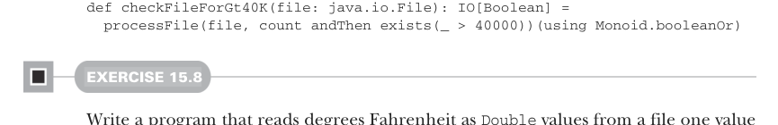

# Page 0452

[<- Page 0451](./page-0451) | [Pages index](./) | [Page 0453 ->](./page-0453)

> Part 4: Effects and I/O / Chapter 15: Stream processing and incremental I/O / 15.2 Simple stream transformations / 15.2.3 Processing files

## 423 15.2 Simple stream transformations

We can now express the core transformation for our line-counting problem as `count` `andThen` `exists(_` `>` `40000)`, and it’s easy to attach filters and other transformations to our pipeline.

### 15.2.3 Processing files

Our original problem of answering whether a file has more than 40,000 elements is now easy to solve—but so far we’ve just been transforming pure streams. Luckily, we can just as easily use a file as the source of elements in a `Stream`, and instead of generating a `Stream` as the result, we can combine all the outputs of the stream into a single final value.

Listing 15.3 Using `Stream` with files instead of `LazyList`

```scala
def fromIterator[O](itr: Iterator[O]): Stream[O] =
Pull.unfold(itr)(itr =>
if itr.hasNext then Right((itr.next(), itr))
else Left(itr)
).void.toStream
def processFile[A](
file: java.io.File,
p: Pipe[String, A],
)(using m: Monoid[A]): IO[A] = IO:
val source = scala.io.Source.fromFile(file)
try fromIterator(source.getLines).pipe(p).fold(m.empty)(m.combine)
finally source.close()
```

The `processFile` function opens the file and uses `fromIterator` to create a `Stream[String]` representing the lines of the file. It then applies the supplied pipe to that stream to get a `Stream[A]` and subsequently reduces that `Stream[A]` to a single `A` by folding over the outputs using a `Monoid[A]`. This entire computation is wrapped in an `IO` to ensure `processFile` remains referentially transparent. We can now solve the original problem with the following:



```scala
def checkFileForGt40K(file: java.io.File): IO[Boolean] =
processFile(file, count andThen exists(_ > 40000))(using Monoid.booleanOr)
```

#### EXERCISE 15.8

Write a program that reads degrees Fahrenheit as `Double` values from a file one value per line, sends each value through a pipe to convert it to degrees Fahrenheit, and writes the result to another file. Your program should ignore blank lines in the input file as well as lines that start with the `#` character. You can use the function `toCelsius`:

```scala
def toCelsius(fahrenheit: Double): Double =
(5.0 / 9.0) * (fahrenheit - 32.0)
def convert(inputFile: String, outputFile: String): IO[Unit]
```

[<- Page 0451](./page-0451) | [Pages index](./) | [Page 0453 ->](./page-0453)
