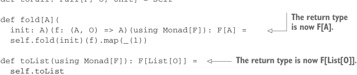

# Page 0457

[<- Page 0456](./page-0456) | [Pages index](./) | [Page 0458 ->](./page-0458)

> Part 4: Effects and I/O / Chapter 15: Stream processing and incremental I/O / 15.3 Extensible pulls and streams

When we encounter an `Uncons` node in the implementation of `step`, we step the source pull and wrap its result in a `Left`. We need a `Monad[F2]` instance to do so, and `step` already has that instance in scope. The remaining operations on `Pull` port to the effectful version with little change—often just needing an adjustment to pass a type parameter for the effect. See the chapter code for more examples.5 How about `Stream` and `Pipe`?

```scala
opaque type Stream[+F[_], +O] = Pull[F, O, Unit]
```

Like `Pull`, `Stream` picks up a new covariant type parameter for the effect type. The various constructors and methods defined for `Stream` all need to be modified to account for this additional type parameter, but since all the heavy lifting is performed by `Pull`, this is an entirely mechanical transformation:


> Returns a Stream[Nothing, Nothing] indicating there’s neither effect evaluation nor output

```scala
object Stream:
def empty: Stream[Nothing, Nothing] = Pull.done
def apply[O](os: O*): Stream[Nothing, O] =
fromList(os.toList)
```

> Returns a Stream[Nothing, O] indicating there’s no effect evaluation

```scala
def fromList[O](os: List[O]): Stream[Nothing, O] =
os match
case Nil => Pull.done
case hd :: tl => Pull.Output(hd) >> fromList(tl)
extension [F[_], O](self: Stream[F, O])
def toPull: Pull[F, O, Unit] = self
```



> The return type is now F[A].

```scala
def fold[A](
init: A)(f: (A, O) => A)(using Monad[F]): F[A] =
self.fold(init)(f).map(_(1))
```

> The return type is now F[List[O]].

```scala
def toList(using Monad[F]): F[List[O]] =
self.toList
```

Like `fold` and `toList` on `Pull`, the equivalent operations on `Stream` now return an effectful action. We say that `fold` and `toList` are *eliminators* of the `Stream` type—interpreting or compiling the algebra of streams into a target monad. Can we still use these eliminators with non-effectful streams? Yes, but it’s a bit awkward. We need to pass an appropriate monad instance explicitly:

> repeat and take delegate to their Pull counterparts. See the chapter code for full definitions.

```scala
scala> val x = Stream(1, 2, 3).
repeat.
take(5).
toList(using Monad.tailrecMonad).
result
val x: List[Int] = List(1, 2, 3, 1, 2)
```

5 The chapter code generally defines operations on `Stream` instead of `Pull`, unless the operation is useful when building recursive pulls.

[<- Page 0456](./page-0456) | [Pages index](./) | [Page 0458 ->](./page-0458)
