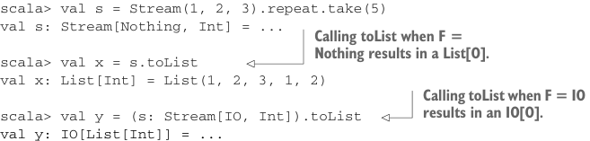

# Page 0458

[<- Page 0457](./page-0457) | [Pages index](./) | [Page 0459 ->](./page-0459)

> Part 4: Effects and I/O / Chapter 15: Stream processing and incremental I/O / 15.3 Extensible pulls and streams

## 429 15.3 Extensible pulls and streams

In this example, we used the `TailRec` monad, so the overall stream computation is stack safe. We need to pass the monad instance explicitly (or otherwise ascribe the type of our stream as `Stream[TailRec,` `Int]`), and we need to run the trampoline by calling `result` on the result of `toList`. We can provide non-effectful versions of each eliminator to avoid this boilerplate:

```scala
extension [O](self: Stream[Nothing, O])
def fold[A](init: A)(f: (A, O) => A): A =
self.fold(init)(f)(using Monad.tailrecMonad).result(1)
def toList: List[O] =
self.toList(using Monad.tailrecMonad).result
scala> val s = Stream(1, 2, 3).repeat.take(5)
val s: Stream[Nothing, Int] = ...
```



> Calling toList when F = Nothing results in a List[O].

```scala
scala> val x = s.toList
val x: List[Int] = List(1, 2, 3, 1, 2)
```

> Calling toList when F = IO results in an IO[O].

```scala
scala> val y = (s: Stream[IO, Int]).toList
val y: IO[List[Int]] = ...
```


Let’s add some new constructors and combinators to `Stream` that work with effects.

#### EXERCISE 15.9

Implement the `eval` constructor on the `Stream` companion object:


```scala
object Stream:
def eval[F[_], O](fo: F[O]): Stream[F, O]
```

#### EXERCISE 15.10

Implement the `mapEval` extension method on the `Stream` type:


```scala
extension [F[_], O](self: Stream[F, O])
def mapEval[O2](f: O => F[O2]): Stream[F, O2]
```

#### EXERCISE 15.11

Implement `unfoldEval` on both the `Stream` and `Pull` companion objects:

```scala
object Stream:
def unfoldEval[F[_], O, R](
init: R)(f: R => F[Option[(O, R)]]): Stream[F, O]
```

[<- Page 0457](./page-0457) | [Pages index](./) | [Page 0459 ->](./page-0459)
