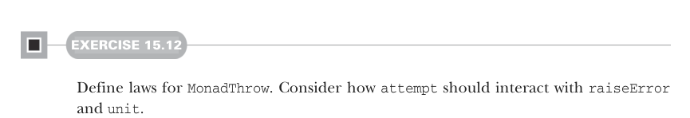

# Page 0462

[<- Page 0461](./page-0461) | [Pages index](./) | [Page 0463 ->](./page-0463)

> Part 4: Effects and I/O / Chapter 15: Stream processing and incremental I/O / 15.3 Extensible pulls and streams / 15.3.2 Handling errors

## 433 15.3 Extensible pulls and streams



#### EXERCISE 15.12

Define laws for `MonadThrow`. Consider how `attempt` should interact with `raiseError` and `unit`.

We can now update the definition of `step` to take a `MonadThrow` instance:

```scala
def step[F2[x] >: F[x], O2 >: O, R2 >: R](
using F: MonadThrow[F2]
): F2[Either[R2, (O2, Pull[F2, O2, R2])]] =
this match
...
case Handle(source, f) =>
source match
case Handle(s2, g) =>
s2.handleErrorWith(x =>
g(x).handleErrorWith(y => f(y))).step
case other =>
other.step
.map:
case Right((hd, tl)) => Right((hd, Handle(tl, f)))
case Left(r) => Left(r)
.handleErrorWith(t => f(t).step)
```


> Rewrite left-nested handlers as rightnested handlers.

> Handle errors that occurred when stepping source pull.

This implementation first checks for left-nested error handlers and rewrites such nesting to be right nested, just like we do for left-nested calls to `flatMap`. Otherwise, it steps the original pull and handles any errors that occurred6 by delegating to the `handleErrorWith` method for the target effect `F`. If no errors occur, then we propagate the error handler to the remainder pull. As a result of `step` taking a `MonadThrow`, the various eliminators all must take a `MonadThrow` as well: `fold`, `toList`, and `run`. We can similarly add support for explicitly raising errors in a pull and stream by introducing a `raiseError` constructor for each. See the chapter code for full details. Now that we have `handleErrorWith` and `raiseError` for stream, we can define `onComplete`:

```scala
extension [F[_], O](self: Stream[F, O])
def onComplete(that: => Stream[F, O]): Stream[F, O] =
self.handleErrorWith(t => that ++ raiseError(t)) ++ that
```

The `onComplete` method allows us to evaluate a stream after the completion of a source stream, regardless of whether the source stream completed successfully or failed with an

6 This implementation is not catching exceptions thrown from the handler itself (i.e., when `f(t)` throws).

[<- Page 0461](./page-0461) | [Pages index](./) | [Page 0463 ->](./page-0463)
