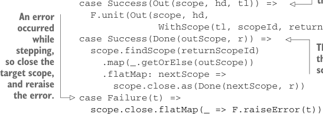

# Page 0469

[<- Page 0468](./page-0468) | [Pages index](./) | [Page 0470 ->](./page-0470)

> Part 4: Effects and I/O / Chapter 15: Stream processing and incremental I/O / 15.3 Extensible pulls and streams / 15.3.3 Ensuring resource safety

the original source stream using the newly opened subscope. Upon termination, we restore the original scope:

```scala
case OpenScope(source, finalizer) =>
scope.open(finalizer.getOrElse(F.unit(()))).flatMap(subscope =>
WithScope(source, subscope.id, scope.id).step(subscope))
```

Modifying `step` for `WithScope` is a bit more involved. We first search the scope tree for the target scope, and then we use that scope to step the source stream. If doing so results in a `Done`, then we close the target scope and look up the scope to return to. Otherwise, we propagate `WithScope` through the remaining stream returned in `Out`:

```scala
case WithScope(source, scopeId, returnScopeId) =>
scope.findScope(scopeId)
.map(_.map(_ -> true).getOrElse(scope -> false))
.flatMap:
case (newScope, closeAfterUse) =>
source.step(newScope).attempt.flatMap:
case Success(Out(scope, hd, tl)) =>
F.unit(Out(scope, hd,
WithScope(tl, scopeId, returnScopeId)))
case Success(Done(outScope, r)) =>
scope.findScope(returnScopeId)
.map(_.getOrElse(outScope))
.flatMap: nextScope =>
scope.close.as(Done(nextScope, r))
case Failure(t) =>
```


> The source outputs an element, so we must propagate WithScope through the tail.



> An error occurred while stepping, so close the target scope, and reraise the error.

> The source terminated, so we close the target scope and reset the next scope to the return scope.

```scala
scope.close.flatMap(_ => F.raiseError(t))
```

With these changes, we can implement `resource` in terms of `Eval` and `OpenScope`:

```scala
def resource[F[_], R](acquire: F[R])(release: R => F[Unit]): Stream[F, R] =
Pull.Eval(acquire).flatMap(r =>
Pull.OpenScope(Pull.Output(r), Some(release(r))))
```

This implementation handles both producer exhaustion and abnormal termination. We still need to do one more thing to handle early termination, though: any time we could potentially discard the remainder of a stream, we must do so in a fresh scope. Doing so ensures that all resources get allocated to subscopes and the entire scope subtree is closed at the earliest appropriate time. Let’s add a `scope` method to `Stream` that opens a new scope, and then let’s introduce such scopes on any operations that may partially evaluate streams—operations like `take`, `takeWhile`, and so on:

```scala
def scope: Stream[F, O] =
Pull.OpenScope(self, None)
def take(n: Int): Stream[F, O] =
self.take(n).void.scope
```

[<- Page 0468](./page-0468) | [Pages index](./) | [Page 0470 ->](./page-0470)
