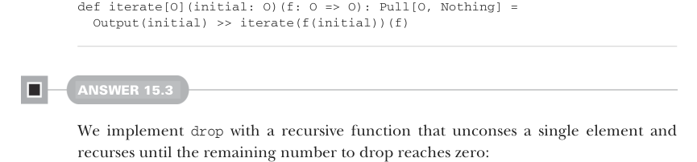

# Page 0474

[<- Page 0473](./page-0473) | [Pages index](./) | [Page 0475 ->](./page-0475)

> Part 4: Effects and I/O / Chapter 15: Stream processing and incremental I/O / 15.6 Exercise answers

## 445 15.6 Exercise answers


```scala
case LazyList() => Left(LazyList())
case hd #:: tl => Right((hd, tl))
.map(_ => ())
```

#### ANSWER 15.2

We output the initial value and then call `iterate` recursively, with the result of `f(initial)` as the new initial value:



```scala
def iterate[O](initial: O)(f: O => O): Pull[O, Nothing] =
Output(initial) >> iterate(f(initial))(f)
```

#### ANSWER 15.3

We implement `drop` with a recursive function that unconses a single element and recurses until the remaining number to drop reaches zero:

```scala
def drop(n: Int): Pull[O, R] =
if n <= 0 then this
else uncons.flatMap:
case Left(r) => Result(r)
case Right((_, tl)) => tl.drop(n - 1)
```

`takeWhile` is similar in that we first uncons an element and then decide whether to recurse. If the unconsed element passes the predicate, then we output it and then call `takeWhile` on the tail. If the unconsed element fails the predicate, then we return that element prepended to the tail as the result of the pull. If instead we exhaust the source, then we return the result:

```scala
def takeWhile(f: O => Boolean): Pull[O, Pull[O, R]] =
uncons.flatMap:
case Left(r) => Result(Result(r))
case Right((hd, tl)) =>
if f(hd) then Output(hd) >> tl.takeWhile(f)
else Result(Output(hd) >> tl)
```

`dropWhile` is very similar to `takeWhile`, except we don’t output the elements that pass the predicate:

```scala
def dropWhile(f: O => Boolean): Pull[Nothing, Pull[O, R]] =
uncons.flatMap:
case Left(r) => Result(Result(r))
case Right((hd, tl)) =>
if f(hd) then tl.dropWhile(f)
else Result(Output(hd) >> tl)
```

[<- Page 0473](./page-0473) | [Pages index](./) | [Page 0475 ->](./page-0475)
