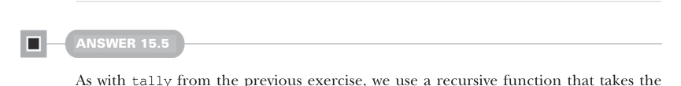

# Page 0475

[<- Page 0474](./page-0474) | [Pages index](./) | [Page 0476 ->](./page-0476)

> Part 4: Effects and I/O / Chapter 15: Stream processing and incremental I/O / 15.6 Exercise answers


#### ANSWER 15.4

We use a recursive function that takes the accumulated total as an argument, along with the next pull. We uncons the next element from the pull and combine it with the total so far. We output the new total and recurse, passing the new total and the tail of the uncons. If instead we exhaust the source pull, then we return the result of the source pull:

```scala
def tally[O2 >: O](using m: Monoid[O2]): Pull[O2, R] =
def go(total: O2, p: Pull[O, R]): Pull[O2, R] =
p.uncons.flatMap:
case Left(r) => Result(r)
case Right((hd, tl)) =>
val newTotal = m.combine(total, hd)
Output(newTotal) >> go(newTotal, tl)
Output(m.empty) >> go(m.empty, this)
```



#### ANSWER 15.5

As with `tally` from the previous exercise, we use a recursive function that takes the current state and the next pull as arguments, representing the state as an immutable queue of integers. The function unconses an element and adds it to the queue, ensuring the queue doesn’t grow beyond the specified size. We then output the mean of the queue and recurse on the tail:

```scala
extension [R](self: Pull[Int, R])
def slidingMean(n: Int): Pull[Double, R] =
def go(
window: collection.immutable.Queue[Int],
p: Pull[Int, R]
): Pull[Double, R] =
p.uncons.flatMap:
case Left(r) => Result(r)
case Right((hd, tl)) =>
val newWindow = if window.size < n then window :+ hd
else window.tail :+ hd
val meanOfNewWindow = newWindow.sum / newWindow.size.toDouble
Output(meanOfNewWindow) >> go(newWindow, tl)
go(collection.immutable.Queue.empty, self)
```


#### ANSWER 15.6

In each of these functions, the accumulator type that was passed to the recursive driver function becomes the state type for `mapAccumulate`. We have to discard the final state by mapping over the result of `mapAccumulate`:

[<- Page 0474](./page-0474) | [Pages index](./) | [Page 0476 ->](./page-0476)
