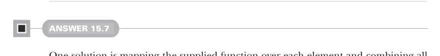

# Page 0476

[<- Page 0475](./page-0475) | [Pages index](./) | [Page 0477 ->](./page-0477)

> Part 4: Effects and I/O / Chapter 15: Stream processing and incremental I/O / 15.6 Exercise answers

## 447 15.6 Exercise answers

```scala
def countViaMapAccumulate: Pull[Int, R] =
Output(0) >> mapAccumulate(0)((s, o) => (s + 1, s + 1)).map(_(1))
def tallyViaMapAccumulate[O2 >: O](using m: Monoid[O2]): Pull[O2, R] =
Output(m.empty) >>
mapAccumulate(m.empty): (s, o) =>
val s2 = m.combine(s, o)
(s2, s2)
.map(_(1))
extension [R](self: Pull[Int, R])
def slidingMeanViaMapAccumulate(n: Int): Pull[Double, R] =
self
.mapAccumulate(Queue.empty[Int]): (window, o) =>
val newWindow = if window.size < n then window :+ o
else window.tail :+ o
val meanOfNewWindow = newWindow.sum / newWindow.size.toDouble
(newWindow, meanOfNewWindow)
.map(_(1))
```



#### ANSWER 15.7

One solution is mapping the supplied function over each element and combining all of the resulting Booleans using the logical OR monoid. This implementation traverses the entire source, instead of halting as soon as an element that passes the predicate is encountered:

```scala
def exists[I](f: I => Boolean): Pipe[I, Boolean] =
src => src.map(f).toPull.tally(using Monoid.booleanOr).toStream
```

We define a halting version in terms of the nonhalting version by combining it with `takeThrough` and `dropWhile`:

```scala
def takeThrough[I](f: I => Boolean): Pipe[I, I] =
src => src.toPull.takeWhile(f)
.flatMap(remainder => remainder.take(1)).void.toStream
def dropWhile[I](f: I => Boolean): Pipe[I, I] =
src => src.toPull.dropWhile(f)
.flatMap(remainder => remainder).void.toStream
def existsHalting[I](f: I => Boolean): Pipe[I, Boolean] =
exists(f) andThen takeThrough(!_) andThen dropWhile(!_)
```

Alternatively, we can replace `dropWhile(!_)` with `last`—a function that outputs the last value of a pull:

```scala
def last[I](init: I): Pipe[I, I] =
def go(value: I, p: Pull[I, Unit]): Pull[I, Unit] =
```

[<- Page 0475](./page-0475) | [Pages index](./) | [Page 0477 ->](./page-0477)
