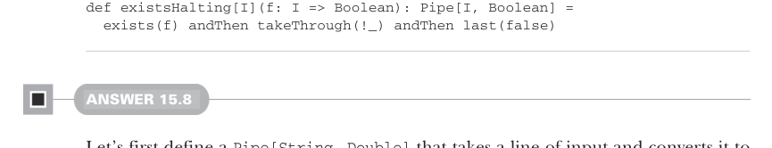

# Page 0477

[<- Page 0476](./page-0476) | [Pages index](./) | [Page 0478 ->](./page-0478)

> Part 4: Effects and I/O / Chapter 15: Stream processing and incremental I/O / 15.6 Exercise answers

```scala
p.uncons.flatMap:
case Left(_) => Pull.Output(value)
case Right((hd, tl)) => go(hd, tl)
src => go(init, src.toPull).toStream
```



```scala
def existsHalting[I](f: I => Boolean): Pipe[I, Boolean] =
exists(f) andThen takeThrough(!_) andThen last(false)
```

#### ANSWER 15.8

Let’s first define a `Pipe[String,` `Double]` that takes a line of input and converts it to Celsius. We can define this as a pipeline of single-responsibility pipes and then compose them all into a single pipe:

```scala
def trimmed: Pipe[String, String] =
src => src.map(_.trim)
def nonComment: Pipe[String, String] =
src => src.filter(_.charAt(0) != '#')
def asDouble: Pipe[String, Double] =
src => src.flatMap: s =>
s.toDoubleOption match
case Some(d) => Stream(d)
case None => Stream()
def convertToCelsius: Pipe[Double, Double] =
src => src.map(toCelsius)
val conversion: Pipe[String, Double] =
trimmed andThen
nonEmpty andThen
nonComment andThen
asDouble andThen
convertToCelsius
```

We then use this pipe to convert the lines of an input file and write each converted output to an output file. We need to write a driver function in the `IO` type; we open the input and output files and use the conversion on the input lines, writing each transformed line to the output file:

```scala
import java.nio.file.{Files, Paths}
def convert(inputFile: String, outputFile: String): IO[Unit] =
IO:
val source = scala.io.Source.fromFile(inputFile)
try
val writer = Files.newBufferedWriter(Paths.get(outputFile))
try
fromIterator(source.getLines)
.pipe(conversion)
```

[<- Page 0476](./page-0476) | [Pages index](./) | [Page 0478 ->](./page-0478)
