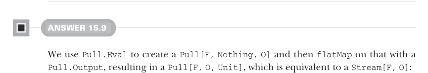

# Page 0478

[<- Page 0477](./page-0477) | [Pages index](./) | [Page 0479 ->](./page-0479)

> Part 4: Effects and I/O / Chapter 15: Stream processing and incremental I/O / 15.6 Exercise answers

## 449 15.6 Exercise answers

```scala
.fold(()): (_, a) =>
writer.write(a.toString)
writer.newLine()
finally writer.close()
finally source.close()
```



#### ANSWER 15.9

We use `Pull.Eval` to create a `Pull[F,` `Nothing,` `O]` and then `flatMap` on that with a `Pull.Output`, resulting in a `Pull[F,` `O,` `Unit]`, which is equivalent to a `Stream[F,` `O]`:


```scala
def eval[F[_], O](fo: F[O]): Stream[F, O] =
Pull.Eval(fo).flatMap(Pull.Output(_))
```

#### ANSWER 15.10

We can use `flatMap` along with `eval`. Since we’re defining this inside the `Stream` companion, and as a result of `Stream` being an opaque type over `Pull`, we have to take care to explicitly reference `Stream.flatMap` and not the `flatMap` method on `Pull`:

```scala
extension [F[_], O](self: Stream[F, O])
def mapEval[O2](f: O => F[O2]): Stream[F, O2] =
Stream.flatMap(self)(o => Stream.eval(f(o)))
```


#### ANSWER 15.11

The implementations are nearly identical—we `Eval(f(init))` and `flatMap` the result, either terminating if the result signals termination or outputting the element and recursing with the new state:

```scala
object Pull:
def unfoldEval[F[_], O, R](init: R)(f: R =>
F[Either[R, (O, R)]]): Pull[F, O, R] =
Pull.Eval(f(init)).flatMap:
case Left(r) => Result(r)
case Right((o, r2)) => Output(o) >> unfoldEval(r2)(f)
object Stream:
def unfoldEval[F[_], O, R](init: R)(f: R =>
F[Option[(O, R)]]): Stream[F, O] =
Pull.Eval(f(init)).flatMap:
case None => Stream.empty
case Some((o, r)) => Pull.Output(o) ++ unfoldEval(r)(f)
```

[<- Page 0477](./page-0477) | [Pages index](./) | [Page 0479 ->](./page-0479)
