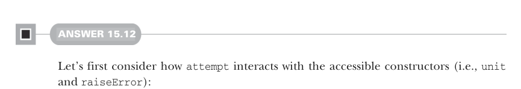

# Page 0479

[<- Page 0478](./page-0478) | [Pages index](./) | [Page 0480 ->](./page-0480)

> Part 4: Effects and I/O / Chapter 15: Stream processing and incremental I/O / 15.6 Exercise answers



#### ANSWER 15.12

Let’s first consider how `attempt` interacts with the accessible constructors (i.e., `unit` and `raiseError`):

```scala
unit(a).attempt == unit(Right(a))
raiseError(t).attempt == unit(Left(t))
```

Let’s also see how `handleErrorWith` interacts with each constructor:

```scala
unit(a).handleErrorWith(h) == unit(a)
raiseError(t).handleErrorWith(h) == h(t)
```

And the following is how `raiseError` interacts with `flatMap`:

```scala
raiseError(t).flatMap(f) == raiseError(t)
```

We could also make some stronger demands on how exceptions are handled. For example, should `unit` catch exceptions thrown from its thunk argument?

```scala
unit(throw new Exception) == raiseError(new Exception)
```

Should exceptions be caught if thrown from the functions passed to `map` and `flatMap`?

```scala
fa.map(_ => throw new Exception) == raiseError(new Exception)
fa.flatMap(_ => throw new Exception) == raiseError(new Exception)
```

There’s no wrong answer, only trade-offs.

[<- Page 0478](./page-0478) | [Pages index](./) | [Page 0480 ->](./page-0480)
