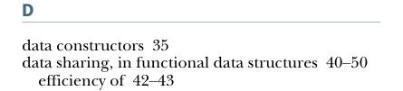

# Page 0481

[<- Page 0480](./page-0480) | [Pages index](./) | [Page 0482 ->](./page-0482)

> index / E

INDEX **452**

lists 43–50 def keyword 17 defining scope 128 dependency injection 6 derived combinator 151 derived operations 186 disjoint union 81 domain 182 drop function 42 dynamic resource allocation 441

B

backtracking controlling 232–233 implementing parser combinators 237–238 balanced fold 259–260 blocking operations 378 blocks 18 Boolean functions 101, 185 Boolean type 96 branching, controlling 232–233

E

C

EDSL (embedded domain-specific language) 355 effect scoping 388 effectful code 355 effects 318, 355 factoring 356–357 handling input effects 358–362 side effects 4–6 data type to enforce scoping of 396–404 random number generation using 118–120 removing 7–9 what counts as 406–407 Either data type 89 accumulating errors 83–85, 322–325 error handling without exceptions 81–89 extracting Validated types 85–89 endofunction function 257 enum keyword 35 eq method 405–406 equals method 25, 198 equational reasoning 11 error handling Either data type 81–89 accumulating errors 83–85 extracting Validated types 85–89 exceptions good and bad aspects of 68–70 possible alternatives to 70–71 Option data type 71–80 composition, lifting, and wrapping 76–80 usage patterns for 72–76 error nesting 230–231 error reporting 228–233 controlling branching and backtracking 232–233 error nesting 230–231 possible design 229–230 exceptions Either data type 81–89 accumulating errors 83–85 extracting Validated types 85–89 good and bad aspects of 68–70

callbacks 164 capability trait 383 case keyword 35 cat operation 385 catchNonFatal function 82, 89 categories 338 category theory 283 ClassTag context bound 403 ClassTag[A] instance 403 combinators monadic combinators 290–291 parser combinators 215–239 refining to their most general form 168–171 use of term 151 combine binary operation 256, 258 combine function 258, 260, 324 companion object 38–39 compose combinator 294 Cons data constructor 36, 38, 99 Console type 372, 377 ConstInt type constructor 332 context parameters 264 context sensitivity 319 parser combinators 225–226 parsing 238–239 context-dependent 69 context-free computations 319 continually function 105, 416 continuations 164 copy method 236 corecursion 104–108 cotermination 106 covary operation 382 create parallel computations 144 curried method 315 Curry, Haskell 29

D

data constructors 35 data sharing, in functional data structures 40–50 efficiency of 42–43

[<- Page 0480](./page-0480) | [Pages index](./) | [Page 0482 ->](./page-0482)
