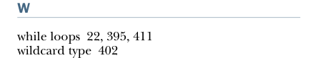

# Page 0487

[<- Page 0486](./page-0486) | [Pages index](./) | [Page 0488 ->](./page-0488)

> index / W

INDEX **458**

strictness and laziness *(continued)* infinite and corecursion 104–108 memoizing and avoiding recomputation 99–100 separation of concerns 101–104 strict and nonstrict functions 95–98 structurally equivalent 40 structure preserving 160, 221 substitution model 4, 11–13 summon method 268, 323 switch statement 38

Traverse abstraction 337 traverse operation 314 Traverse trait 334, 336 traverse trampolining 79, 329, 331, 337 Try data type 88 type constructors 266, 284 type lambdas 299 type parameters 26 type variables 26 typecasing 159 typeclasses 263–265 *Typed Tagless Final Interpreters* (Kiselyov) 385

T

U

tagless final interpreters 385 tail position 22–23 tail-recursive functions 16 tailrec annotation 23, 426 TailRec data type 367–368 Task type 443 test case minimization 182 theorems 158 thunks 97 total function 72 trait keyword 120 trampolining 366–368, 388 traversable functors 313 overview of 329–331 uses of 331–337 combining traversable structures 335 from monoids to applicative functors 332–333 monad composition 336–337 nested traversals 336 traversal fusion 336 traversals with State 333–334 using composed monoids to fuse 269

unapply function 197 unfold function 106 union types 380 unit action 124 unit function 128–129, 131, 151–152, 158, 171, 287–290, 294–295, 299, 314, 317, 337 Unit type 19 using keyword 264–265

V

val keyword 18 Validated types, extracting 85–89 var keyword 18 variables 40 variadic function 37 variance annotation 37 void type 19

W

while loops 22, 395, 411 wildcard type 402

[<- Page 0486](./page-0486) | [Pages index](./) | [Page 0488 ->](./page-0488)
