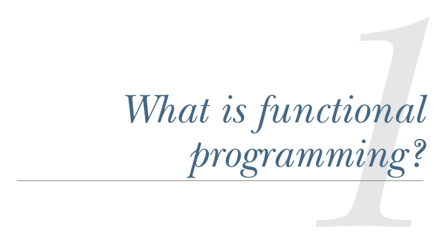

# Страница 0032
[<- Страница 0031](./page-0031) | [Индекс страниц](./) | [Страница 0033 ->](./page-0033)

> Часть 1: Введение в функциональное программирование / Глава 1: Что такое функциональное программирование?

## Что такое функциональное программирование?

### Эта глава охватывает

- Понимание плюсов функционального программирования (и почему это не хуйня из академии)
- Определение чистых функций
- Референциальная прозрачность (referential transparency), чистота и модель подстановки (substitution model)

Функциональное программирование (FP) держится на простой, но пиздец какой мощной идее с последствиями на километр: мы собираем проги исключительно из *чистых функций* — тех самых, что не оставляют после себя ни хуя, никаких *побочных эффектов*. А что за побочки такие? Это когда функция не просто возвращает тебе результат и мирно сваливает, а ещё и нагадит где-то сбоку. Типа вот этого дерьма:

- Мутишь переменную
- Изнасилуешь структуру данных на месте (in-place mutation, блядь)
- Подкрутишь поле в объекте
- Кинешь исключение (exception) или вообще рухнешь с ошибкой

**3**

[<- Страница 0031](./page-0031) | [Индекс страниц](./) | [Страница 0033 ->](./page-0033)
