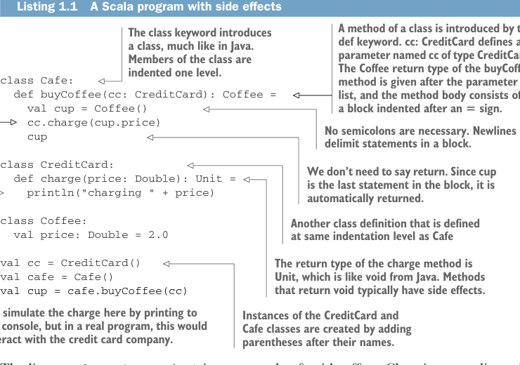
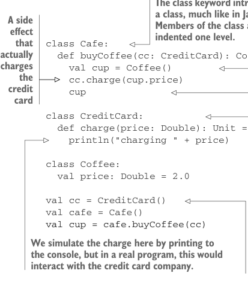

# Страница 0034
[<- Страница 0033](./page-0033) | [Индекс страниц](./) | [Страница 0035 ->](./page-0035)

> Часть 1: Введение в функциональное программирование / Глава 1: Что такое функциональное программирование? / 1.1 Понимание плюсов функционального программирования / 1.1.1 Программа с побочными эффектами

## 5 1.1 Понимание плюсов функционального программирования



**Листинг 1.1. Программа на Scala с побочными эффектами**

> Метод класса начинается с `def`. `cc: CreditCard` — параметр `cc` типа `CreditCard`. Тип возвращаемого значения `Coffee` метода `buyCoffee` стоит после списка параметров, а тело — блок с отступом после `=`.

> Класс объявляется через `class`, как в Java. Члены класса — с отступом на один уровень.



> Побочный эффект, который реально списывает бабки с кредитки.

```scala
class Cafe:
def buyCoffee(cc: CreditCard): Coffee =
val cup = Coffee()
cc.charge(cup.price)
cup
```

> Точек с запятой не надо. Новые строки разбивают statements в блоке.

```scala
class CreditCard:
def charge(price: Double): Unit =
println("charging " + price)
```

> `return` говорить не нужно. `cup` — последнее в блоке, так что автоматически вернётся.

```scala
class Coffee:
val price: Double = 2.0
```

> Ещё один класс, на том же уровне отступа, что и `Cafe`.

```scala
val cc = CreditCard()
val cafe = Cafe()
val cup = cafe.buyCoffee(cc)
```

> Тип возврата `charge` — `Unit`, это как `void` в Java. Методы с `void` обычно и мутируют мир побочками.
>
> Тут симулируем списание принтом в консоль, но в реале это был бы колл к кредитной конторе.
>
> Инстансы `CreditCard` и `Cafe` создаём скобками после имён.

Строка `cc.charge(cup.price)` — это хрестоматийный побочный эффект, бля. Списание с кредитки — это ж трах с внешним миром: стучишься в их веб-сервис, авторизуешь транзу, дерёшь бабки и, если прокатит, пихаешь запись в свою БД для истории. А функция просто кидает `Coffee` и делает вид, что чистенькая, а все эти грязные делишки — *на стороне* (отсюда side effect, как измена в браке). Формально разберём позже в главе. Из-за этого тестировать — пиздец: неохота в тестах реально кардинку жечь у юзера! Это кричит о рефакторинге; `CreditCard` не должен знать, как ебаться с кредиткой или логировать в свои системы — это не его епархия. Сделаем код модульным и тестовым: пусть `CreditCard` будет в blissful ignorance этих заморочек, а мы закинем ему объект `Payments` прямо в `buyCoffee`.

**Листинг 1.2. Добавляем объект `Payments`**

```scala
class Cafe:
def buyCoffee(cc: CreditCard, p: Payments): Coffee =
val cup = Coffee()
p.charge(cc, cup.price)
cup
```

> У `CreditCard` больше нет методов, так что двоеточие после `class` не нужно.

```scala
class CreditCard
```

[<- Страница 0033](./page-0033) | [Индекс страниц](./) | [Страница 0035 ->](./page-0035)
