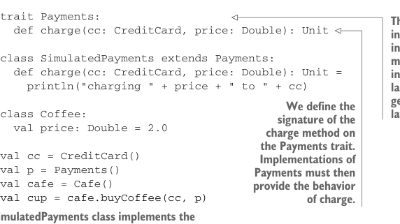
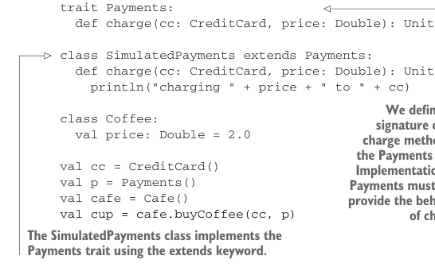

# Страница 0035
[<- Страница 0034](./page-0034) | [Индекс страниц](./) | [Страница 0036 ->](./page-0036)

> Часть 1: Введение в функциональное программирование / Глава 1: Что такое функциональное программирование? / 1.1 Понимание плюсов функционального программирования / 1.1.1 Программа с побочными эффектами





```scala
trait Payments:
def charge(cc: CreditCard, price: Double): Unit
```

> Ключевое слово `trait` заводит новый интерфейс. Трейты — это не хухры-мухры как интерфейсы из других языков, они почище будут, но разберёмся с этим мясом позже в книге. Мы тут сигнатуру метода `charge` на трейте `Payments` объявили. Любая реализация `Payments` обязана под него подогнать поведение `charge`. А класс `SimulatedPayments` этот трейт реализует через `extends` — классика жанра.

```scala
class SimulatedPayments extends Payments:
def charge(cc: CreditCard, price: Double): Unit =
println("charging " + price + " to " + cc)
class Coffee:
val price: Double = 2.0
val cc = CreditCard()
val p = Payments()
val cafe = Cafe()
val cup = cafe.buyCoffee(cc, p)
```

Мы вырвали логику чарджа в интерфейс `Payments` — по сути, впихнули *dependency injection* (DI, впрыскивание зависимостей), как будто душу из демона выковыряли, чтоб не кусался так сильно. Побочки всё равно вылазят, когда зовём `p.charge(cc, cup.price)`, но хоть тестируемость вернули на уровень "не полный пиздец". Можем слепить заглушку под `Payments` для тестов, но и это не райские кущи. Приходится насиловать `Payments` в интерфейс, хотя конкретный класс мог бы и прокатить, а любая заглушка — это сплошной геморрой в юзании. Скажем, она тащит внутренний стейт, где чарджы трекает, — после `buyCoffee` ковыряйся в нём пальцем, проверяя, мутировалось ли оно как надо от вызова `charge`. Можем, конечно, *mock-фреймворк* (фреймворк для моков) натаскать, чтоб он это говно за нас разгребал, но блядь, это же оверкилл чистой воды, если цель — просто удостовериться, что `buyCoffee` генерит чардж на цену чашки кофе.<sup>2</sup>

Кроме тестового ада, ещё одна беда: `buyCoffee` хрен переиспользуешь. Допустим, Алиса хочет 12 чашек кофе — идеально было бы `buyCoffee` в цикле 12 раз дёрнуть. Но как есть сейчас, это 12 контактов с платёжкой, 12 отдельных авторизаций на её карту! Комиссии растут как на дрожжах, ни Алисе ни кофейне не в кайф. Что делать? Можем новую функцию `buyCoffees` с нуля слепить, с батчингом чарджей внутри.<sup>3</sup> Тут, может, и не трагедия, логика `buyCoffee` простая как валенок, но в реальной жизни дублировать непростое мясо — это слёзы и потерянный код-риьюз, композицию хуем можно назвать!

<sup>2</sup> Некоторые mock-фреймворки (фреймворки для моков) даже конкретные классы мокать умеют, так что `Payments` можно вообще не плодить, а перехватывать `charge` прямо на классе `CreditCard`. Есть нюансы и трейд-оффы, но мы их тут не ковыряем. 

<sup>3</sup> Или слепить спец-имплементацию `BatchingPayments` под интерфейс `Payments`, которая как-то батчит последовательные чарджы на одну карту. Но это уже тёмный лес: сколько чарджей батчить? Сколько ждать? Заставлять ли `buyCoffee` сигнализировать конец батча, скажем, вызовом `closeBatch`? И откуда ей знать, когда это уместно, а?

[<- Страница 0034](./page-0034) | [Индекс страниц](./) | [Страница 0036 ->](./page-0036)
