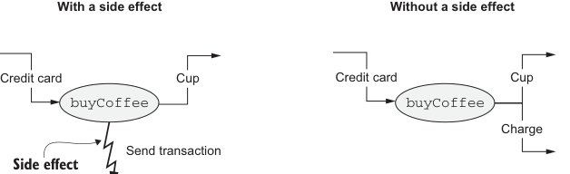
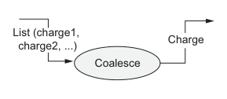

# Страница 0037
[<- Страница 0036](./page-0036) | [Индекс страниц](./) | [Страница 0038 ->](./page-0038)

> Часть 1: Введение в функциональное программирование / Глава 1: Что такое функциональное программирование? / 1.1 Понимание плюсов функционального программирования / 1.1.2 Функциональное решение: выкидываем побочные эффекты нахуй


```scala
val purchases: List[(Coffee, Charge)] =
List.fill(n)(buyCoffee(cc))
val (coffees, charges) = purchases.unzip
val reduced =
charges.reduce((c1, c2) => c1.combine(c2))
(coffees, reduced)
```

> `List.fill(n)(x)` штампует список с n копиями `x`, как фабрика на конвейере. Точнее, это n последовательных вычислений `x` — ленивых или нет, разберём стратегии оценки в главе 5, там будет мясо.

> `unzip` рвёт список пар на пару списков. Тут мы деструктурируем эту пару в одну строку, объявляя кофе и списания — чистый сахар.

> Списываем бабки симуляцией в консоль, но в реальной херне это пингует банк или платёжный шлюз, чтоб не в минус уйти.

**Вызов **`buyCoffee`



**С побочным эффектом**

**Без побочного эффекта**


Кофе Кредитка Кофе Кредитка

```scala
buyCoffee
buyCoffee
```

Списание

Отправить транзакцию

> Побочный эффект

> Если `buyCoffee` возвращает объект списания вместо того, чтоб ебаться с сайд-эффектами, коллер легко склеит кучу списаний в одну транзу (и потестит `buyCoffee` без танцев с бубном вокруг платёжки).

Сервер кредиток

> Без сервера кредиток `buyCoffee` не потестишь; две транзы в одну не слепишь — классический пиздец мутабельного мира.



Список (списание1, списание2,...)

Списание

Собрать в кучу

Рисунок 1.1 Вызов за кофе

В общем, это решение — как апгрейд с Жигулей на Tesla: теперь ``buyCoffee`` переиспользуем напрямую для ``buyCoffees``, обе функции тестятся на раз-два без мокирования какой-то хуйни вроде интерфейса ``Payments``. ``Cafe`` теперь вообще похуй, как обрабатывать ``Charge` — мы можем слепить отдельный класс ``Payments`` для реальной обработки списаний, но ``Cafe`` про него ни сном ни духом. Сделав ``Charge`` полноценным значением первого сорта, мы открыли ящик Пандоры с бонусами: бизнес-логику для списаний теперь собираем как Lego. Скажем, Алиса таскает ноут в кофейню, кодит часами, периодически берёт латте. Было бы заебись, если кофейня склеила все её покупки в одну транзу, опять сэкономив на комиссиях,

[<- Страница 0036](./page-0036) | [Индекс страниц](./) | [Страница 0038 ->](./page-0038)
