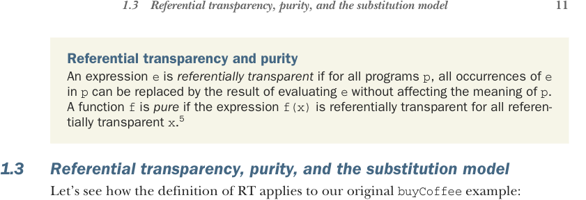

# Страница 0040
[<- Страница 0039](./page-0039) | [Индекс страниц](./) | [Страница 0041 ->](./page-0041)

> Часть 1: Введение в функциональное программирование / Глава 1: Что такое функциональное программирование? / 1.3 Реферециальная прозрачность, чистота и модель подстановки



## 1.3 Реферециальная прозрачность, чистота и модель подстановки

Реферециальная прозрачность и чистота. Выражение `e` *реферециально прозрачно*, если во всех программах `p` все вхождения `e` в `p` можно заменить результатом вычисления `e`, не меняя смысл `p`. Функция `f` *чистая*, если выражение `f(x)` реферециально прозрачно для всех реферециально прозрачных `x`.[^5]

### 1.3 Реферециальная прозрачность, чистота и модель подстановки

Давайте разберёмся, как это определение реферециальной прозрачности (RT, referential transparency) применяется к нашему изначальному примеру с `buyCoffee`:

```scala
def buyCoffee(cc: CreditCard): Coffee =
val cup = Coffee()
cc.charge(cup.price)
cup
```

Что бы ни возвращала `cc.charge(cup.price)` (ну, скажем, `Unit` (который в Scala — аналог `void` из других языков)), это отбрасывается `buyCoffee`. Короче, результат `buyCoffee(aliceCreditCard)` — это просто `cup`, что эквивалентно `new Coffee()`. Чтобы `buyCoffee` была чистой по нашему определению RT, должно быть так, что `p(buyCoffee(aliceCreditCard))` ведёт себя идентично `p(Coffee())` в любой программе `p`. Ясно же, что это хуйня полная не катит: программа `Coffee()` нихуя не делает, а `buyCoffee(aliceCreditCard)` уже стучит в кредитку и авторизует списание. Уже видимая разница между программами, блядь.

RT навязывает инвариант, что всё, что функция вытворяет, отражено в значении, которое она возвращает, по типу результата. Эта хуйня позволяет рассуждать о вычислениях просто и естественно — через *модель подстановки* (substitution model). Когда выражения реферециально прозрачны, представь, что вычисления идут как в школьной алгебре: полностью раскрываешь каждую часть выражения, подставляешь переменные вместо их значений, а потом сводить к простейшей форме. На каждом шаге заменяешь термин эквивалентным; вычисления — это подстановка *равного* за *равное*. Другими словами, RT даёт *эквациональное рассуждение* (equational reasoning) о программах, как в матане, сука.

Посмотрим ещё два примера — один, где все выражения RT и можно по модели подстановки думать, и один, где какая-то хуйня RT нарушает. Ничего сложного, просто иллюстрируем то, что вы и так, наверное, шаритесь. Давай закинем в интерпретатор Scala (он же REPL — read-eval-print loop, цикл чтения-вычисления-печати, произносится как *ripple*, но с *э* вместо *и*). Интерпретатор — это интерактивный промпт, куда кидаешь программу, он её вычисляет, печатает результат и ждёт следующую. Когда готов принять программу, мигает `scala>`.

[^5]: Тут есть нюансы в определении, позже в книге уточним. Загляни в заметки к главе на нашем GitHub (https://github.com/fpinscala/fpinscala/wiki) за подробностями.

[<- Страница 0039](./page-0039) | [Индекс страниц](./) | [Страница 0041 ->](./page-0041)
