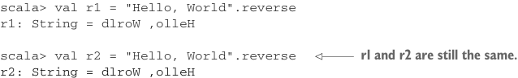

# Страница 0041

[<- Страница 0040](./page-0040) | [Индекс страниц](./) | [Страница 0042 ->](./page-0042)

> Часть 1: Введение в функциональное программирование / Глава 1: Что такое функциональное программирование? / 1.3 Референциальная прозрачность, чистота и модель подстановки

программы, интерпретатор вываливает имя результата, его тип и само значение. Кстати, в Java и Scala строки — *immutable* (неизменяемые), блядь. *Изменённая* строка — это на деле новая строка, а старая чиллит себе целёхонькой:

```scala
scala> val x = "Hello, World"
x: java.lang.String = Hello, World
scala> val r1 = x.reverse
r1: String = dlroW ,olleH
```

> r1 и r2 — одинаковые.

```scala
scala> val r2 = x.reverse
r2: String = dlroW ,olleH
```

Допустим, мы заменим все вхождения терма `x` на выражение, на которое ссылается `x` (его *определение*), вот так:

```scala
scala> val r1 = "Hello, World".reverse
r1: String = dlroW ,olleH
```



> r1 и r2 по-прежнему одинаковые.

```scala
scala> val r2 = "Hello, World".reverse
r2: String = dlroW ,olleH
```

Эта подстановка ни хуя не меняет в результате. Значения `r1` и `r2` те же, что и раньше, так что `x` была референциально прозрачной (referential transparency, RT). Более того, `r1` и `r2` тоже RT, так что если они вылезут в другой части большой программы, их можно везде подменить своими значениями — и программе будет похуй, ничего не разъебётся. 

Теперь глянем на функцию, которая не RT, сука. Возьмём `append` на классе `java.lang.StringBuilder`. Эта хрень мутирует `StringBuilder` на месте. Предыдущее состояние `StringBuilder` улетает в пизду после вызова `append`. Давай потестируем:

```scala
scala> val x = new StringBuilder("Hello")
x: java.lang.StringBuilder = Hello
scala> val y = x.append(", World")
y: java.lang.StringBuilder = Hello, World
scala> val r1 = y.toString
r1: java.lang.String = Hello, World
scala> val r2 = y.toString
r2: java.lang.String = Hello, World
```

> r1 и r2 — одинаковые.

Пока заебись, всё ок. А теперь увидим, как *side-effect* (побочный эффект) разъебёт RT в хлам. Допустим, подставим вызов `append`, как раньше, заменив все вхождения `y` на выражение, на которое ссылается `y`:

[<- Страница 0040](./page-0040) | [Индекс страниц](./) | [Страница 0042 ->](./page-0042)
