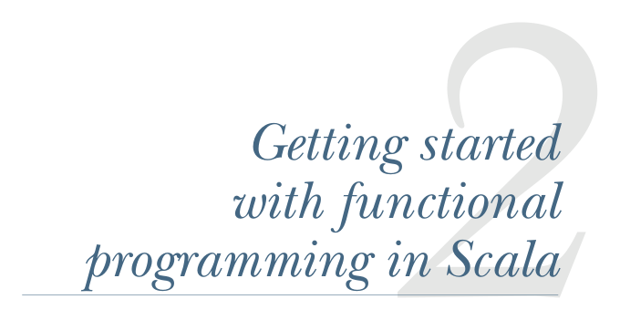
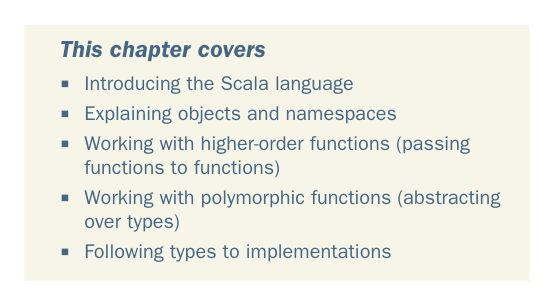

# Страница 0044
[<- Страница 0043](./page-0043) | [Индекс страниц](./) | [Страница 0045 ->](./page-0045)

> Часть 1: Введение в функциональное программирование / Глава 2: Первые шаги с функциональным программированием в Scala

## Первые шаги с функциональным программированием в Scala

### Что покрывает эта глава

- Знакомство с языком Scala
- Разбор объектов и пространств имён
- Работа с функциями высшего порядка (передача функций в функции)
- Работа с полиморфными функциями (абстрагирование над типами)
- Следование типам к реализациям

Теперь, когда мы дали обет использовать только чистые функции — типа монахов в коде, без побочек и мутаций, — сразу встает вопрос на засыпку: а как, на хуй, писать даже самые примитивные проги? Мы все привыкли к императивному стилю (imperative style), где код — это цепочка команд, выполняемых по порядку, как солдаты на плацу, и каждая такая команда оставляет след в мире: print'ит, меняет состояние, дергает API. В этой главе мы нырнем в Scala и научимся лепить программы чисто из комбинаций чистых функций — без единого побочного эффекта (side effect), как конструктор Lego для FP-архитектуры.

**15**

[<- Страница 0043](./page-0043) | [Индекс страниц](./) | [Страница 0045 ->](./page-0045)
