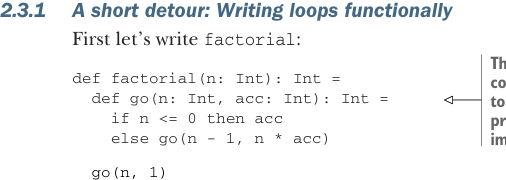

# Страница 0050
[<- Страница 0049](./page-0049) | [Индекс страниц](./) | [Страница 0051 ->](./page-0051)

> Часть 1: Введение в функциональное программирование / Глава 2: Первые шаги с функциональным программированием в Scala / 2.3 Функции высшего порядка: Передача функций в функции / 2.3.1 Короткий отходец: Циклы по-функциональному

## 21 2.3 Функции высшего порядка: Передача функций в функции

Заметте, пацаны, даже такая хрень, как `2` `+` `1` — это просто вызов члена объекта, без всяких иллюзий. Тут мы тыкаем в мембер `+` объекта `2`. Чистый синтаксический сахар для `2.+(1)`, где `1` летит аргументом в метод `+` на объекте `2`. Любой метод с одним аргументом и символическим именем можно юзать инфиксно — без точки и скобок, как будто они старые кореша. В будущих версиях Scala алфанумерики запрут: только если метод помечен как `infix` `def` или в бэктиках. Например, вместо `MyProgram.abs(42)` пиши `MyProgram` ```abs``` `42` and get the same result. This infix enforcement can be enabled now by adding `-source:future` and `-deprecation` — флаги компилятора, чтоб не расслаблялись (они уже впилены в билд из репо этой книги). Можем вытащить мембер объекта в скоуп *импортом*, и потом звать его без префикса, как родного:

```scala
scala> import MyProgram.abs
import MyProgram.abs
scala> abs(-42)
val res0: 42
```

Все (неприватные) мемберы объекта в скоуп — через звёздочку, классика жанра:

```scala
import MyProgram.*
```

### 2.3 Функции высшего порядка: Передача функций в функции Разобрались с синтаксисом Scala на базовом уровне — пора в мясо функционального кодинга. Первая бомба: функции — это значения, такие же, как инты, стрінки или листы. Их пихаем в переменки, складываем в дата-структуры, передаём аргументами другим функциям — полный фарш. В чистом FP часто лепим функции, которые жрут другие функции как аргументы, — higher-order functions, короче. Покажу простые примеры, чтоб дошло. Дальше в главах поймёте, какая это пушка и как она пропитывает весь стиль FP, как кофе утро. А для разгона представьте: допиливаем прогу, чтоб она и абс числа выводила, и факториал другого числа. Вот как это может выглядеть в рантайме:

```scala
The absolute value of -42 is 42
The factorial of 7 is 5040
```

### 2.3.1 Короткий отходец: Циклы по-функциональному Сначала напишем факториал, без паники:



> Это вложенная функция, локальное определение. В Scala норма — лепить функции внутри других, как матрёшки. В FP не выпячивай её важнее локальных интов или стрінгов, они все равны.

```scala
def factorial(n: Int): Int =
def go(n: Int, acc: Int): Int =
if n <= 0 then acc
else go(n - 1, n * acc)
go(n, 1)
```

[<- Страница 0049](./page-0049) | [Индекс страниц](./) | [Страница 0051 ->](./page-0051)
