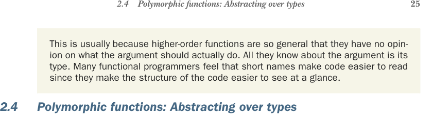

# Страница 0054
[<- Страница 0053](./page-0053) | [Индекс страниц](./) | [Страница 0055 ->](./page-0055)

> Часть 1: Введение в функциональное программирование / Глава 2: Начало работы с функциональным программированием в Scala / 2.4 Полиморфные функции: Абстрагирование над типами / 2.4.1 Пример полиморфной функции



## 2.4 Полиморфные функции: Абстрагирование над типами

Обычно так выходит, потому что функции высшего порядка — такие универсальные хуи, что им абсолютно похуй, что аргумент там реально вытворяет. Они знают про него только тип, и всё. Многие FP-шники уверены: короткие имена код делают проще для глаз — структура сразу как на ладони лежит, без лишнего жира.

### 2.4 Полиморфные функции: Абстрагирование над типами

Пока мы ковырялись только с *мономорфными* функциями — теми, что жрут один конкретный тип данных и не рыпаются. Взять тех же `abs` и `factorial` — они заточены под аргументы типа `Int`, а высшая `formatResult` тоже прикована к функциям, которые хавают `Int`. Но часто, особенно когда пилишь высшие, хочется код, который проглотит любой тип, кинь не кинь. Это и есть *полиморфные функции*<sup>8</sup>, и впереди вас ждёт тонна практики по их лепке. А тут просто в курс дела введём, чтоб не в слепую.

### 2.4.1 Пример полиморфной функции

Полиморфные функции часто вылазят на свет, когда замечаешь, что куча мономорфных имеют одну и ту же костную структуру под шкурой. Взять вот эту мономорфную `findFirst` — она возвращает первый индекс в массиве, где ключ спрятался, или -1, если того нет. Заточена под поиск `String` в `Array[String]`, классика жанра.

**Листинг 2.3. Мономорфная функция для поиска `String` в массиве**

```scala
def findFirst(ss: Array[String], key: String): Int =
@annotation.tailrec
def loop(n: Int): Int =
if n >= ss.length then -1
else if ss(n) == key then n
else loop(n + 1)
```


> Если `n` за концом массива, верни -1 — ключа в массиве нету.


> Иначе плюсуй `n` и копай дальше.  
> Стартуй цикл с первой хуйни в массиве.

```scala
loop(0)
```

> `ss(n)` вытаскивает n-й элемент из массива `ss`. Если он совпадает с ключом, верни `n` — элемент на этом индексе.

Детали кода тут не суть — главное, что код для `findFirst` будет почти один в один, если ищешь `String` в `Array[String]`, `Int` в `Array[Int]` или `A` в `Array[A]` для любого типа `A`. Можем сделать `findFirst` по-настоящему универсальной для любого `A`, просто впихнув функцию для проверки конкретного значения `A`. Кстати, последнее обобщение не обязательно на 100% — могли б просто взять целевой ключ типа `A`. Но это предполагает, что у типа есть годный `equals`, а вдруг нет? Типа, привет из продакшена.

<sup>8</sup> Мы термин *полиморфизм* юзаем чуть по-другому, чем в ООП-тусовке, где он обычно про субтипинг или наследование. Тут ни интерфейсов, ни субтипов — чистый *параметрический полиморфизм* (parametric polymorphism), чтоб элегантно абстрагироваться.

[<- Страница 0053](./page-0053) | [Индекс страниц](./) | [Страница 0055 ->](./page-0055)
