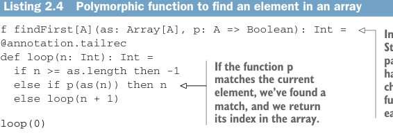

# Страница 0055

[<- Страница 0054](./page-0054) | [Индекс страниц](./) | [Страница 0056 ->](./page-0056)

> Часть 1: Введение в функциональное программирование / Глава 2: Первые шаги с функциональным программированием в Scala / 2.4 Полиморфные функции: абстрагируемся от типов / 2.4.2 Вызов высших функций с анонимками



Листинг 2.4. Полиморфная функция для поиска элемента в массиве — универсальный охотник за сокровищами

```scala
def findFirst[A](as: Array[A], p: A => Boolean): Int =
@annotation.tailrec
def loop(n: Int): Int =
if n >= as.length then -1
else if p(as(n)) then n
else loop(n + 1)
```

> Вместо того чтобы хардкодить `String`, берём универсальный тип `A` как параметр. И вместо примитивной проверки на равенство с ключом, впихиваем функцию, которой будем тестить каждый элемент массива по очереди.

> Если эта функция `p` сработает на текущем элементе — бинго, нашли! Возвращаем его индекс в массиве, как нормальный следопыт.

```scala
loop(0)
```

Это классика полиморфной функции, или, как иногда говорят, *генерик*. Мы абстрагировались от типа массива и от самой логики поиска — чистый кайф, как в хорошем абстрактном ФП, где ничего не пришьёшь гвоздями. Чтобы слепить такую полиморфную функцию как метод, впереди имени (тут `findFirst`) лепим список параметров типов в квадратных скобках — обычно короткие заглавные буквы вроде `[A]`, `[A, B, C]`. Можно хоть `[Foo, Bar, Baz]` или `[TheGreatType, AnotherOneBitesTheDust]`, компилятор не пикнет, но по конвенции все пацаны юзают односимвольные uppercase, чтоб не раздувать сигнатуру, как воздушный шарик на код-ревью.

Этот список типов вводит *типовые переменные*, которые потом можно юзать везде в сигнатуре — точь-в-точь как параметры функции в её теле. В `findFirst` наш `A` мелькает дважды: элементы массива — это `Array[A]`, а функция `p` жрёт `A => Boolean`. Из-за этого компилятор жёстко enforc'ит: типы должны совпадать, иначе — типовая ошибка в ебало. Попробуй поискать `String` в `Array[Int]` — и привет, mismatch, как в жизни, когда типы не сошлись на свидании.

### 2.4.2 Вызов высших функций с анонимными функциями  
Когда юзаешь высшие функции (higher-order, те, что жрут другие функции на завтрак), часто охота не городить отдельный именованный метод, а впихнуть *анонимку* или *function literal* прямо на месте. Вместо "давай, найди мне готовую функцию из коробки". Например, потести `findFirst` в REPL'е вот так:

```scala
scala> findFirst(Array(7, 9, 13), (x: Int) => x == 9)
val res2: Int = 1
```

Тут пара свежих фишек. `Array(7, 9, 13)` — это *array literal*, как конструктор Lego: бац — и новый массив с тремя интами, без всякого `new`, чистый Scala-стиль, без boilerplate'а, чтоб не бесило. А `(x: Int) => x == 9` — *function literal*, она же *анонимная функция*. Вместо того чтобы лепить метод с именем и регистрировать в object'е, пишем inline, как записку на салфетке. Берёт `x: Int`, возвращает `Boolean` — "это девятка или хуйня?".

[<- Страница 0054](./page-0054) | [Индекс страниц](./) | [Страница 0056 ->](./page-0056)
