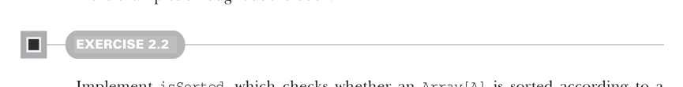

# Страница 0056
[<- Страница 0055](./page-0055) | [Индекс страниц](./) | [Страница 0057 ->](./page-0057)

> Часть 1: Введение в функциональное программирование / Глава 2: Первые шаги с FP в Scala / 2.5 От типов к реализациям

## 27 2.5 От типов к реализациям

В общем-то, аргументы функции лепятся слева от стрелки `=>`, а потом мы их по полной юзаем в теле справа от неё — как в мясорубке, куда кидаешь ингредиенты и крутишь котлеты.  
Скажем, если нужна фигня вроде проверки на равенство (equality checker) для двух `Int`-ов, чтоб проверить, одинаковые ли они, то запилим вот так:

```scala
scala> (x: Int, y: Int) => x == y
val res0: (Int, Int) => Boolean = Lambda$1240/0x00000008006dc840@121cf6f4
```

Эта хрень `(Int, Int) => Boolean`, которую REPL вывалил, значит, что `res0` — это функция, которая жрёт два интовых аргумента и сплёвывает `Boolean`.  
А `Lambda$1240/0x00000008006dc840@121cf6f4` — это просто строковое дерьмо от инстанса функции после вызова `toString`, нахуй оно никому не нужно, игнорим.  
Когда Scala сама допрёт типы инпутов из контекста, аннотации на аргументах можно опустить — типа `(x, y) => x < y`.  
Пример увидишь в следующем разделе, а дальше по книге их дохуя.



#### УПРАЖНЕНИЕ 2.2

Запили `isSorted`, которая проверяет, отсортирован ли `Array[A]` по заданной функции сравнения `gt` — возвращает `true`, если первый параметр больше второго (типа, для убывающего порядка, чтоб не как у лохов):

```scala
def isSorted[A](as: Array[A], gt: (A, A) => Boolean): Boolean
```

Твоя реализация `isSorted` должна выдать вот такие результаты:

```scala
scala> isSorted(Array(1, 2, 3), _ > _)
val res0: Boolean = true
scala> isSorted(Array(1, 2, 1), _ > _)
val res1: Boolean = false
scala> isSorted(Array(3, 2, 1), _ < _)
val res2: Boolean = true
```


```scala
scala> isSorted(Array(1, 2, 3), _ < _)
val res3: Boolean = false
```

### 2.5 От типов к реализациям

Как ты, наверное, просёк, когда `isSorted` строчил, вселенная возможных имплементаций резко сжимается, если функция полиморфная.  
Если она полиморфна по какому-то типу `A`, то на этом `A` можно только те операции крутить, которые как аргументы в функцию засунул (или которые из них вывести можно, как трюк с кроликом из шляпы).

[<- Страница 0055](./page-0055) | [Индекс страниц](./) | [Страница 0057 ->](./page-0057)
