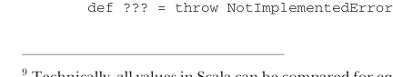

# Страница 0057
[<- Страница 0056](./page-0056) | [Индекс страниц](./) | [Страница 0058 ->](./page-0058)

> Часть 1: Введение в функциональное программирование / Глава 2: Первые шаги с функциональным программированием в Scala / 2.5 Следуя за типами к реализациям

данные операции).[^9] Бывает, что вселенная вариантов для полиморфного типа сжимается в точку — и остаётся ровно одна возможная реализация! 

Давай разберём пример сигнатуры функции, которую по-другому и не заимплементишь. Это высшая-order хрень для *частичного приложения* (partial application). Функция `partial1` жрёт значение и функцию с двумя аргументами, а возвращает функцию с одним. Название от того, что применяем функцию не ко всем аргументам, а только к паре-тройке:

```scala
def partial1[A, B, C](a: A, f: (A, B) => C): B => C
```

У `partial1` три параметра типа: `A`, `B` и `C`. Берёт два аргумента. `f` — сама функция, которая хапает `A` и `B` по очереди и сплёвывает `C`. А `partial1` возвращает `B => C`. 

Как эту высшую-order штуку заимплементить? Оказывается, компилится только один вариант, и он логически вытекает из сигнатуры, как дважды два. Это как лёгкая логическая загадочка на разминку. И не думай, что чистая теория — в реальном FP ты вечно собираешь кубики-лего единственно возможным способом, чтоб не рухнуло. 

Упражнение для того, чтоб набить руку на высших-order функциях и на том, как типы Scala ведут тебя за ручку. Начнём с возвращаемого: тип `B => C`, значит, возвращаем функцию такого рода. Пишем function literal с аргументом `B`:

```scala
def partial1[A, B, C](a: A, f: (A, B) => C): B => C =
  (b: B) => ???
```

Поначалу странно, если не привык к анонимкам. Откуда `B` взялся? А мы щас написали: «Верни функцию, которая жрёт `b` типа `B`». Справа от `=>` (где ???) — тело этой анонимки. `b` там юзаем свободно, как и `a` в теле `partial1` — по той же причине.[^10]

В теле анонимки `???` — это встроенная функция Scala, которая просто кидает ошибку `NotImplementedError`. Это как placeholder на стероидах, все так юзают, чтоб наращивать фичу по кирпичику. Полное определение `???`:



```scala
def ??? = throw NotImplementedError
```

[^9]: Строго говоря, все значения в Scala сравнимы на равенство (`==`), строкуются через `toString` и хэшатся `hashCode`. Но это бородавка от Java, типа «ну и хуй с ним, legacy».

[^10]: В теле внутренней функции внешний `a` всё ещё в скоупе. Говорим, что внутренняя функция *захватывает* (closes over) окружение, включая `a`.

[<- Страница 0056](./page-0056) | [Индекс страниц](./) | [Страница 0058 ->](./page-0058)
