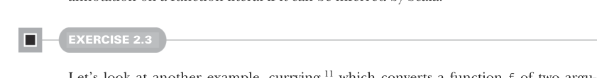
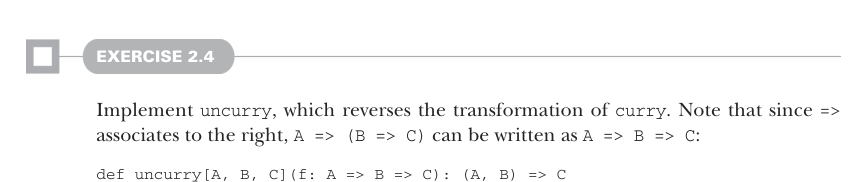

# Страница 0058
[<- Страница 0057](./page-0057) | [Индекс страниц](./) | [Страница 0059 ->](./page-0059)

> Часть 1: Введение в функциональное программирование / Глава 2: Первые шаги с функциональным программированием в Scala / 2.5 Следуя за типами к реализациям

## 29 2.5 Следуя за типами к реализациям

Продолжаем копать глубже, пацаны. Теперь, когда мы запросили значение типа `B`, что возвращаем из нашей анонимной функции? Подпись типа орёт: это должно быть значение типа `C`, и способ получить такое — один-единственный, как в меме с "there's only one way". По подписи C — это тип возвращаемого значения от функции `f`. Так что заполучить `C` можно только кинув туда `A` и `B` в `f`. Легкотня, блядь:

```scala
def partial1[A, B, C](a: A, f: (A, B) => C): B => C =
(b: B) => f(a, b)
```

И вуаля, готово! Получили функцию высшего порядка, которая берёт функцию с двумя аргументами и частично её применяет — классика partial application, через которую каждый FP-новичок проходит с лицом "о, сука, как же это гениально". Короче, если у нас есть `A`, а функция жрёт и `A`, и `B`, чтоб выдать `C`, то теперь можем слепить новую, которой хватит только `B` для `C` (ведь `A` уже в кармане). Это как бартер в духе "дай яблоко с бананом — получи морковку", а если яблоко уже отдал заранее, то просто суй банан — и морковка твоя, без лишнего геморроя. Кстати, аннотация типа на `b` тут нахуй не нужна. Мы сказали Scala, что возвращаем `B => C`, так что тип `b` она выведет из контекста сама, как умная тёлка, и можно просто вписать `b => f(a,b)` как имплементацию. В общем, на код-ревью всегда говорим: опускай типы на лямбдах, если Scala не тупит — она не тупит.



#### УПРАЖНЕНИЕ 2.3

Давай глянем ещё один пример — куринг[^11], который превращает функцию `f` двух аргументов в функцию одного аргумента, частично применяющую `f`. Снова только одна имплементация скомпилится, типы сами всё подскажут. Пиши:

```scala
def curry[A, B, C](f: (A, B) => C): A => (B => C)
```

Обратите внимание, тип `A` `=>` `(B` `=>` `C)` читается как функция, которая жрёт A и возвращает новую функцию от `B` к `C`*.



#### УПРАЖНЕНИЕ 2.4

Реализуй `uncurry`, которая переворачивает трансформацию от `curry`. Заметь, что поскольку `=>` ассоциируется справа, `A => (B => C)` можно писать как `A => B => C`:

```scala
def uncurry[A, B, C](f: A => B => C): (A, B) => C
```

[^11]: Названо в честь математика Хэскелла Карри, который открыл этот принцип. Независимо раньше его открыл Моисей *Шёнфинкель*, но «шёнфинкелизация» не прижилась — звучит как побочка от антибиотиков.

[<- Страница 0057](./page-0057) | [Индекс страниц](./) | [Страница 0059 ->](./page-0059)
