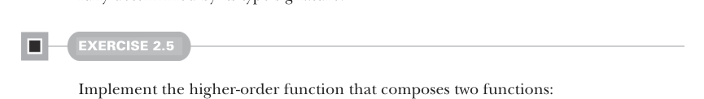

# Страница 0059

[<- Страница 0058](./page-0058) | [Оглавление страниц](./) | [Страница 0060 ->](./page-0060)

> Часть 1: Введение в функциональное программирование / Глава 2: Первые шаги с функциональным программированием в Scala / 2.6 Заключение

Давай глянем на финальный пример — *композицию функций*, когда выход одной функции впихиваем прямиком в пасть входа другой. Как конвейер в сталелитейке: один цех сливает шлак следующему. Снова реализация этой хуйни полностью определяется сигнатурой типа — типы тут как строгий прораб, диктуют каждый шаг без вариантов.



#### УПРАЖНЕНИЕ 2.5

Реализуй функцию высшего порядка, которая компонует две функции:

```scala
def compose[A, B, C](f: B => C, g: A => B): A => C
```

Это такая типичная кухня в FP, что стандартная либа Scala уже подкинула `compose` как метод на `Function1` (интерфейсе для функций, которые жрут ровно один аргумент). Чтобы скомпоновать две функции `f` и `g`, пишем `f` `compose` `g`.<sup>12</sup> Ещё есть метод `andThen`. `f` `andThen` `g` — это то же самое, что `g` `compose` `f`:

```scala
scala> val f = (x: Double) => math.Pi / 2 - x
val f: Double => Double = <function1>
scala> val cos = f andThen math.sin
val cos: Double => Double = <function1>
```

Красота собирать такие oneliners, как пазл из лего, но что с жирным реал-ворлд кодбейсом в миллион строк? В FP — похуй, тот же вайб. Функции высшего порядка вроде `compose` не парятся, огромный монстр это или скромный oneliner. Полиморфные HOF часто выходят универсальными, как швейцарский нож, — потому что ни хуя не говорят про конкретный домен, а просто выдирают общий паттерн, который везде торчит. Поэтому кодинг в большом — зеркало кодинга в малом, без подвохов. В книге напишем пачку таких универсалов, а упражнения тут — как пробник стиля мышления, когда лепишь такие функции: типы ведут за ручку.

### 2.6 Заключение

В этой главе мы наскребли базового Scala, чтоб не сдохнуть на старте, плюс ввелись в FP-концепты по-лёгкому. Научились лепить простые функции и проги, включая петли через рекурсию (да, без мутабельного дерьма, чисто рекурсия, блядь); потом HOF подкатили, попрактиковались в полиморфных функциях на Scala. Увидели, как типы загоняют имплементацию в узкий коридор — следуй сигнатуре, и код сам ложится, без мозгоёбства. Это мы ещё нахлебаемся в главах впереди.

<sup>12</sup>Решить упражнение `compose` через эту либовую функцию — чистое читерство, пацаны.

[<- Страница 0058](./page-0058) | [Оглавление страниц](./) | [Страница 0060 ->](./page-0060)
