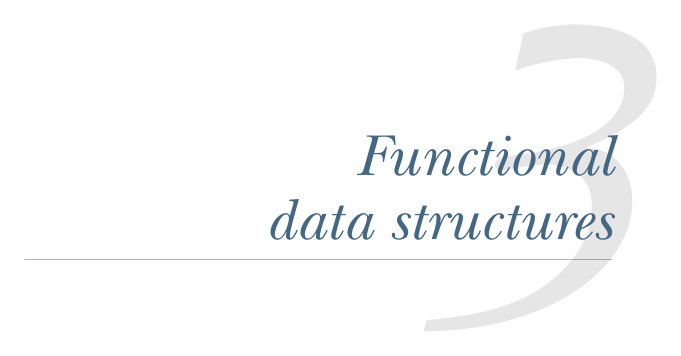

# Страница 0063
[<- Страница 0062](./page-0062) | [Индекс страниц](./) | [Страница 0064 ->](./page-0064)

> Часть 1: Введение в функциональное программирование / Глава 3: Функциональные структуры данных

## Функциональные структуры данных

### Что разберём в этой главе

Определение функциональных структур данных

Паттерн-матчинг во всей красе

Делёжка данными без мутации

Рекурсия по спискам и подъём до высших функций

Алгебраические типы данных

Пацаны, во введении мы уже херачили, что функциональные проги не ковыряют переменные мутабельно и не ебутся с изменяемыми структурами данных, как в том imperative аду. И вот вопрос на миллион баксов: а на каких data structures тогда кодить в FP? Как их в Scala слепить, чтоб не сдохнуть? И как с ними работать, чтоб стек не переполнился на первой же рекурсии? В этой главе нырнём в *функциональные структуры данных* — это как лего из immutable блоков, где каждый "апдейт" рождает новую копию, но с умной делёжкой, чтоб памяти не жрать как свинья. Заодно разберём, как типы данных в FP лепить (не то что case class'ы на коленке), освоим *паттерн-матчинг* — это switch на стероидах, который сам через это прошёл и знает, где подвох с nested cases, и натренируемся писать чистые функции, обобщая их до higher-order магии, чтоб код сиял как после рефакторинга.

**34**

[<- Страница 0062](./page-0062) | [Индекс страниц](./) | [Страница 0064 ->](./page-0064)
