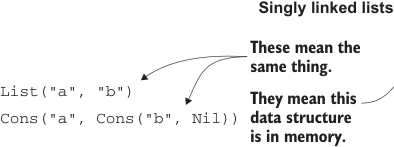
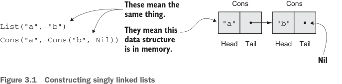

# Страница 0065

[<- Страница 0064](./page-0064) | [Индекс страниц](./) | [Страница 0066 ->](./page-0066)

> Часть 1: Введение в функциональное программирование / Глава 3: Функциональные структуры данных / 3.1 Определение функциональных структур данных

У перечисления `List` ровно два таких конструктора данных — они описывают две возможные формы списка. Как видно на рисунке 3.1, `List` может быть пустым (это конструктор `Nil`) или непустым (конструктор `Cons`, традиционно сокращение от *construct* (construct), типа «построить»). Непустой список — это начальный элемент `head` (голова), за которым следует `List` остальных элементов (`tail` (хвост), который сам может быть пустым):

```scala
case Nil
case Cons(head: A, tail: List[A])
```



**Односвязные списки**



> Это значит одно и то же.

```
Cons
```

```
Cons
```

```scala
"a"
"b"
List("a", "b")
```

> Это значит, что структура данных живёт в памяти.

```scala
Cons("a", Cons("b", Nil))
```

```
Хвост   Голова
```

```
Хвост   Голова
```

> Nil

Рисунок 3.1 Построение односвязных списков

Функции бывают полиморфными? Так и типы данных могут — просто лепим параметр типа `[+A]` после `enum List`, и список становится полиморфным по типу элементов внутри. Короче, одна и та же хрень работает для `List[Int]`, `List[Double]`, `List[String]` и всего остального. (Плюсик перед `A` — это ковариантность (covariance); за деталями в сайдбар «Больше про variance».) Каждый конструктор данных даёт тебе функцию для сборки этой формы. Вот парочка примеров:

```scala
val ex1: List[Double] = List.Nil
val ex2: List[Int] = List.Cons(1, List.Nil)
val ex3: List[String] = List.Cons("a", List.Cons("b", List.Nil))
```

`case Nil` позволяет писать `List.Nil` для пустого списка, а `case Cons` — строить цепочки вроде `List.Cons(1, List.Nil)`, `List.Cons("a", List.Cons("b", List.Nil))` и так далее, на любой длины². Заметьте, `List` параметризован типом `A`, так что это полиморфные функции — подставляй любой `A`. В `ex2` — `Int`, в `ex3` — `String`. А `ex1` забавный: `Nil` тут инстанцируется с

² Scala генерит дефолтный метод `def toString: String` для enum'ов — для дебага в самый раз. В REPL увидишь: `List.Cons(1, List.Nil)` отрендерится как `"Cons(1,Nil)"`. Но этот `toString` наивно рекурсивный, и на длинных списках — бам, стек-оверфлоу. В проде сам не раз переписывал, чтоб не ебаться с этим дерьмом.

[<- Страница 0064](./page-0064) | [Индекс страниц](./) | [Страница 0066 ->](./page-0066)
