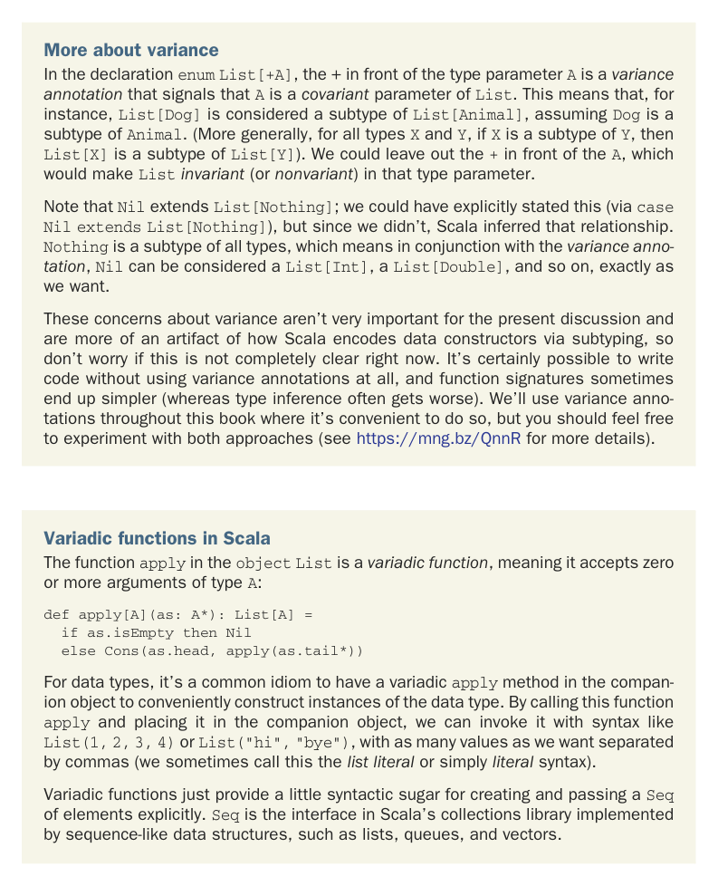

# Страница 0066
[<- Страница 0065](./page-0065) | [Индекс страниц](./) | [Страница 0067 ->](./page-0067)

> Часть 1: Введение в функциональное программирование / Глава 3: Функциональные структуры данных / 3.1 Определение функциональных структур данных

## 37 3.1 Определение функциональных структур данных

тип `List[Double]`, что вполне себе катит, потому что пустой список — это вообще пустота, никаких элементов, и его можно выдать за список любого типа, какого душа пожелает! Каждый конструктор данных ещё и *паттерн* впихивает, который юзается для *паттерн-матчинга* (pattern matching), как в наших `sum` и `product`. Паттерн-матчинг разберём по косточкам чуть позже.



Больше про variance. В объявлении `enum List[+A]` этот плюс перед параметром типа `A` — *аннотация variance* (variance annotation), которая орёт на всю улицу, что `A` — *ковариантный* (covariant) параметр `List`. Короче, `List[Dog]` считается подтипом `List[Animal]`, если `Dog` <: `Animal`. (В общем-то, для любых `X` и `Y`, если `X` <: `Y`, то `List[X]` <: `List[Y]`). Могли бы плюсик снести — и `List` стал бы *инвариантным* (invariant, или *невариантным*, как хотите) по этому параметру.

Заметим, `Nil` extends `List[Nothing]`; могли бы явно пропечатать (`case Nil extends List[Nothing]`), но Scala сам просёк тему. `Nothing` — подтип всего на свете, а с *variance-аннотацией* `Nil` вдруг превращается в `List[Int]`, `List[Double]` и прочее — ровно то, что нам и нужно, без лишнего геморроя.

Эти разборки с variance сейчас не принципиальны, чисто артефакт того, как Scala *data-конструкторы* (data constructors) через subtyping лепит, так что не ебитесь, если не всё на 100% ясно. Можно вообще без variance-аннотаций кодить, сигнатуры проще выходят (inference, правда, иногда тупит похуже). В книге юзаем их, где удобно, но сами экспериментируйте с обоими подходами (подробнее в https://mng.bz/QnnR).

### Вариадические функции в Scala

Функция `apply` в `object List` — это *вариадическая функция* (varargs), жрёт ноль или больше аргументов типа `A`:

```scala
def apply[A](as: A*): List[A] =
if as.isEmpty then Nil
else Cons(as.head, apply(as.tail*))
```

Для дата-типов — классический приём: вариадический `apply` в companion object, чтоб инстансы лепить на раз-два. Назвали `apply` и запихнули в companion — и привет, `List(1,2,3,4)` или `List("hi","bye")`, сколько влезет значений через запятую (это мы зовём *литерал списка* (list literal) или просто *литерал*).

Вариадические функции — чистый сахар для создания и передачи `Seq`-элементов явно. `Seq` — это trait из коллекций Scala, который имплемтят все последовательные твари вроде списков, очередей и векторов.

[<- Страница 0065](./page-0065) | [Индекс страниц](./) | [Страница 0067 ->](./page-0067)
