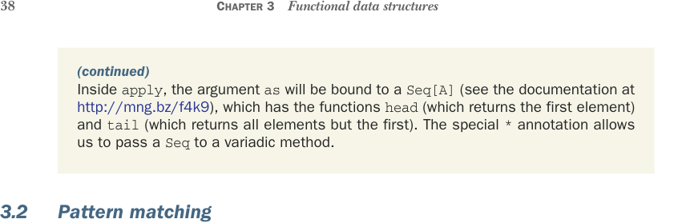

# Страница 0067
[<- Страница 0066](./page-0066) | [Индекс страниц](./) | [Страница 0068 ->](./page-0068)

> Часть 1: Введение в функциональное программирование / Глава 3: Функциональные структуры данных / 3.2 Сопоставление с образцом



### (продолжение) Внутри apply аргумент as привяжется к Seq[A] (загляните в доки по http://mng.bz/f4k9), у которой есть head (первый элемент) и tail (всё, кроме первого). Специальная хрень со звёздочкой * позволяет запихнуть Seq в вариадический метод, как в том старом трюке с *args в Java, только без слёз по ночам.

### 3.2 Сопоставление с образцом

Давайте разберём по косточкам функции `sum` и `product`, которые мы закинули в объект `object` `List` — он же *companion object* к классу `List` (см. сайдбар про компаньон-объекты в Scala). Обе эти определения юзают сопоставление с образцом, и это как switch на стероидах, который не просто сравнивает, а роет вглубь структуры, как экскаватор в коде:

```scala
object List:
def sum(ints: List[Int]): Int = ints match
case Nil => 0
case Cons(x, xs) => x + sum(xs)
def product(doubles: List[Double]): Double = doubles match
case Nil => 1.0
case Cons(0.0, _) => 0.0
case Cons(x, xs) => x * product(xs)
```

Как и ожидалось (а если нет — то блядь, срочно в FP-школу), функция `sum` говорит: сумма пустого списка — это `0`, а сумма непустого — первый элемент `x` плюс сумма остатка `xs`.³ Точно так же `product` вещает: произведение пустого списка — `1.0`, если список стартует с `0.0` — сразу `0.0` (short-circuit, чтоб не ебаться с нулями дальше), а для любого другого непустого — первый элемент умножить на произведение хвоста. Обратите внимание, это рекурсивные определения — типичная хуйня для функций над рекурсивными типами данных вроде `List` (который рекурсивно ссылается на себя в конструкторе `Cons`, как змея, кусающая свой хвост, только без StackOverflowError в проде, если не дебил).

Сопоставление с образцом работает как навороченный `switch`, который может нырнуть внутрь структуры выражения, которое ковыряет, и вытащить оттуда подвыражения, как хирург скальпелем. Оно начинается с выражения-цели (*target* или *scrutinee*), типа `ds`, за ним ключевое слово `match` и цепочка кейсов. Каждый кейс в матче — это паттерн (вроде `Cons(x,` `xs)`) слева от `=>` и результат (типа `x` `*` `product(xs)`) справа от `=>`. Если цель *матчится* с паттерном в кейсе (об этом дальше), то результат этого кейса становится результатом всего матча. Если несколько паттернов матчатся — Scala берёт первый, никаких неоднозначностей, как в жизни.

³ Можем там назвать `x` и `xs` хоть Петькой и Васей, но конвенция у всех нормальных — `xs`, `ys`, `as` или `bs` для последовательностей всяких, а `x`, `y`, `a` или `b` для одного элемента из неё. Ещё классика — `h` или `hd` для первого элемента списка (*head*), `t` или `tl` для остатка (*tail*), и `l` для всего списка целиком. Я сам через это прошёл — первые годы именовал как попало, пока на код-ревью не прилетело.

[<- Страница 0066](./page-0066) | [Индекс страниц](./) | [Страница 0068 ->](./page-0068)
