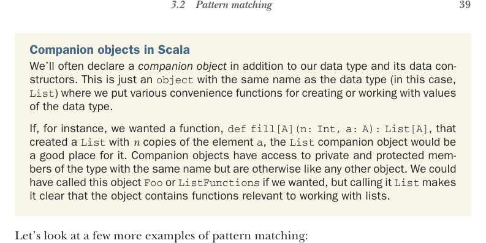
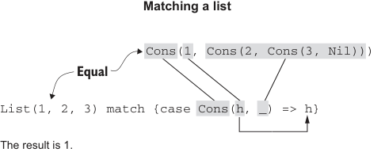

# Страница 0068

[<- Страница 0067](./page-0067) | [Указатель страниц](./) | [Страница 0069 ->](./page-0069)

> Часть 1: Введение в функциональное программирование / Глава 3: Функциональные структуры данных / 3.2 Сопоставление с образцом



## 39 3.2 Сопоставление с образцом

Компаньон-объекты в Scala. Мы часто лепим *компаньон-объект* прямо рядом с типом данных и его конструкторами. Это просто `object` с тем же именем, что и тип (в нашем случае, `List`), куда мы запихиваем всякие удобные функции для создания или ковыряния значений этого типа. Представь: твой case class — это крутой парень, а компаньон — его кореш, который знает все приватные заморочки и фабричные методы наизусть.

Допустим, нам нужна функция вроде `def` `fill[A](n:` `Int,` `a:` `A):` `List[A]`, которая генерит `List` с *n* копиями элемента `a`. Идеальное место для неё — компаньон-объект `List`. Он имеет доступ к приватным и protected-замкнутым членам типа с тем же именем, но в остальном — обычный object, как твой кофейный автомат в офисе. Могли бы назвать его `Foo` или `ListFunctions`, но `List` сразу орёт: "Эй, пацаны, тут функции чисто про списки, не путайтесь!"

Давай глянем ещё пару примеров сопоставления с образцом, чтоб в голове улеглось, как в код-ревью на пиве разбираем:

 `List(1,2,3)` `match` `{` `case` `_` `=>` `42` `}` даёт `42`. Тут variable pattern `_` — это как wildcard в regex, жрёт любой кусок выражения. Могли бы пихнуть `x` или `foo` вместо `_`, но `_` — это наш де-факто стандарт, чтоб сразу видно: "Значение нахуй не нужно, игнорим".^4

 `List(1,2,3)` `match` `{` `case` `Cons(h,` `_)` `=>` `h` `}` выдаёт `1`. Конструкторный паттерн в паре с переменными — это как разбор матрёшки: хватаем подвыражение цели и биндим его. Схема на рисунке 3.2, чтоб не путаться.

 `List(1,2,3)` `match` `{` `case` `Cons(_,` `t)` `=>` `t` `}` порождает `List(2,` `3)`.

 `List(1,2,3)` `match` `{` `case` `Nil` `=>` `42` `}` кидает `MatchError` в рантайме. `MatchError` — это когда ни один кейс не подошёл к цели, классика "ничего не сошлось".^5

В большинстве примеров Scala орёт предупреждением: паттерн не полный, рискуешь `MatchError` в проде словить. Я сам так жрал тапки в дебаге, пока не привык.



**Сопоставление со списком**

```scala
Cons(1, Cons(2, Cons(3, Nil)))
```

> Равно

```scala
List(1, 2, 3) match {case Cons(h, _) => h}
```

Результат — 1.

Рисунок 3.2 Сопоставление с образцом на списке

^4 Паттерн `_` особенный — его можно повторять в паттерне несколько раз, чтоб игнорить кучу частей цели сразу.  
^5 Scala часто на компиле чует, если match не покрывает все кейсы, и выдаёт варнинг.

[<- Страница 0067](./page-0067) | [Указатель страниц](./) | [Страница 0069 ->](./page-0069)
