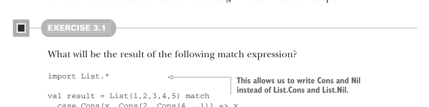

# Страница 0069
[<- Страница 0068](./page-0068) | [Индекс страниц](./) | [Страница 0070 ->](./page-0070)

> Часть 1: Введение в функциональное программирование / Глава 3: Функциональные структуры данных / 3.3 Общий доступ к данным в функциональных структурах данных

Бля, пацаны, что решает, матчит ли паттерн выражение, как пазл в голове? Паттерн может тащить *литералы*, типа `3` или `"hi"` — это как жёсткие константы, не сдвинешь; *переменные*, вроде `x` и `xs`, которые сожрут хуйню любую, если имя с маленькой буквы или подчёркивание — они как чёрная дыра для подвыражений; и data-конструкторы (data constructors), типа `Cons(x, xs)` и `Nil`, которые цепко держат только свою родную форму, как строгий визажист. (`Nil` как паттерн берёт только чистое `Nil`, а `Cons(h, t)` или `Cons(x, xs)` матчит исключительно `Cons`-значения — никаких компромиссов.) Эти кирпичики паттерна можно гнездить как матрёшку на стероидах; `Cons(x1, Cons(x2, Nil))` и `Cons(y1, Cons(y2, Cons(y3, _)))` — вполне себе валидные монстры. Паттерн совпадает с целью, если размажешь переменные по её подвыражениям так, чтоб структура стала *структурно идентичной* — как клон по ДНК. И вуаля, в выигрышном кейсе эти присваивания лежат в локалке, как пиво после код-ревью.



#### УПРАЖНЕНИЕ 3.1

Что наворотит этот match-выражение?

```scala
import List.*
```

> Это позволяет писать Cons и Nil вместо List.Cons и List.Nil — короче, как ленивый хакер любит.

```scala
val result = List(1,2,3,4,5) match
case Cons(x, Cons(2, Cons(4, _))) => x
case Nil => 42
case Cons(x, Cons(y, Cons(3, Cons(4, _)))) => x + y
case Cons(h, t) => h + sum(t)
case _ => 101
```

Пиздец как рекомендую поковырять паттерн-матчинг в REPL (Read-Eval-Print Loop), чтоб прочувствовать, как эта хуйня дышит. В REPL удобно импорнуть всю кухню из companion-объекта `List` через `import List.*` — и привет, пишешь `Cons(1, Nil)` вместо многослойного `List.Cons(1, List.Nil)`, как нормальный чел. Только в REPL не путай наш `List` из этой главы с родным Scala-`List` — это как спутать домашний самогон с заводским. Если ковыряешь код из GitHub-репозитория, то выглядит так:


> Импортим Cons и Nil (и прочую мелочёвку) из companion-объекта List, затеняя встроенный Scala Nil — классический оверрайд (override), пацаны.

> Импортим List-тип из fpinscala.exercises.datastructures, затеняя родной Scala List — теперь наш в приоритете.

```scala
scala> import fpinscala.exercises.datastructures.List
scala> import List.*
scala> val x: List[Int] = Cons(1, Nil)
val x: fpinscala.exercises.datastructures.List[Int] = Cons(1,Nil)
```

> Строим значение fpinscala.exercises.datastructures.List[Int], а не встроенный Scala List[Int] — не перепутай, а то пиздец в дебаге.

### 3.3 Общий доступ к данным в функциональных структурах данных

Когда данные неизменяемы, как ебать функции, чтоб, скажем, добавить или выкинуть элемент из списка? Ответ проще пареной репы. Когда лепим элемент 1 вперёд списка,

[<- Страница 0068](./page-0068) | [Индекс страниц](./) | [Страница 0070 ->](./page-0070)
