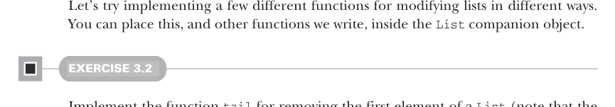

```yaml
---
title: "Страница 0070"
outline: false
---
```

# Страница 0070

[<- Страница 0069](./page-0069) | [Индекс страниц](./) | [Страница 0071 ->](./page-0071)

> Часть 1: Введение в функциональное программирование / Глава 3: Функциональные структуры данных / 3.3 Обмен данными в функциональных структурах данных

## 3.3 Обмен данными в функциональных структурах данных

У уже существующего списка, скажем `xs`, мы возвращаем *новый* список — в этом случае `Cons(1, xs)`. Поскольку списки неизменяемые, копировать `xs` нахуй не надо; просто переиспользуем его, как старый добрый блокчейн — неизменно и вечно. Это и зовётся *обмен данными* (*data sharing*). Когда делишься неизменяемыми данными, функции пишутся эффективнее, будто на стероидах: возвращаешь структуру, и не ссышь, что следующий код её подмонтирует или сломает. Никаких пессимистичных копий заранее, чтоб избежать мутаций или коррупции.<sup>6</sup>

Тот же прикол с удалением: чтоб снести голову списка `val mylist = Cons(x, xs)`, просто кидаем его хвост `xs`. Никакого реального удаления — оригинал `mylist` жив-здоров, как кот после девяти жизней. Функциональные структуры данных *персистентны* (*persistent*) — операции не трогают старые ссылки, всё как в git-репозитории с ветками. Обмен данными показан на рисунке 3.3.


**Обмен данными**

```scala
"a"
"b"
"c"
"d"
List("a", "b", "c", "d")
List("b", "c", "d")
.tail
```

> Оба списка делят одни и те же данные в памяти. `.tail` не модифицирует оригинал; просто ссылается на его хвост. Защитное копирование не нужно, потому что список неизменяемый.

Рисунок 3.3 Обмен данными в списках



Давай замутим пару функций для разных модификаций списков — кидай их в companion object `List`, как я всегда делаю в проде.

#### УПРАЖНЕНИЕ 3.2

Замути функцию `tail`, чтоб снести первый элемент `List` (и она летает за константу, без профита). Бросай exception через `sys.error("message")`, если `List` — `Nil`. В след. главе разберём обработку ошибок по-взрослому. Только юзай enum `List` и кейс `Nil` отсюда, а не встроенные Scala `List` и `Nil` — не путай, братан.

<sup>6</sup> Пессимистичные копии — это жесть в больших системах. Когда мутабельные данные гоняют по цепочке слабо связанных (*loosely coupled*) компонентов, каждый делает свою копию, потому что все друг друга боятся. А с immutable — шаринг везде безопасен, копий ноль. В итоге FP в крупном масштабе эффективнее сайд-эффектных подходов за счёт мега-шаринга данных и вычислений.

[<- Страница 0069](./page-0069) | [Индекс страниц](./) | [Страница 0071 ->](./page-0071)
