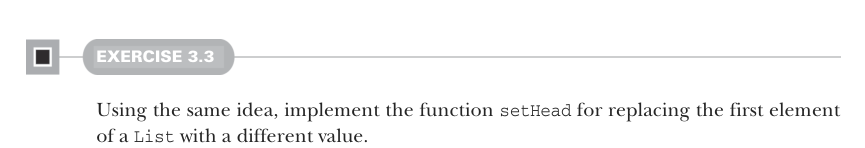
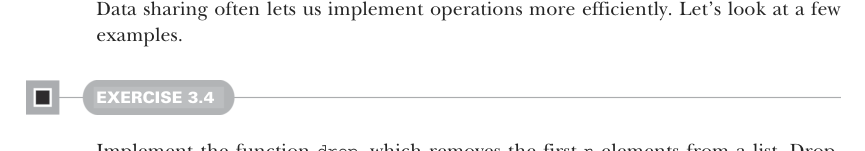

# Страница 0071
[<- Страница 0070](./page-0070) | [Индекс страниц](./) | [Страница 0072 ->](./page-0072)

> Часть 1: Введение в функциональное программирование / Глава 3: Функциональные структуры данных / 3.3 Общий доступ к данным в функциональных структурах / 3.3.1 Эффективность общего доступа к данным



#### УПРАЖНЕНИЕ 3.3

По той же схеме, как мы только что разобрали, заимплиментите функцию `setHead`, которая меняет первый элемент `List` на другое значение. 
Просто, как два байта обнулить, но с общим хвостом (shared tail) — хвост не трогаем.

### 3.3.1 Эффективность общего доступа к данным



Общий доступ к данным — это как cheat code в старом Doom: позволяет операции делать быстрее, без лишней копипасты. 
Давайте глянем на примеры, где это выстреливает.

#### УПРАЖНЕНИЕ 3.4

Заимплиментите функцию `drop`, которая срет первые `n` элементов из списка. 
Если список пустой, а срать `n` штук — возвращай пустой. 
Фишка: время бегает только по числу сранных элементов, копировать весь `List` не надо, хвост просто подцепляем:


```scala
def drop[A](as: List[A], n: Int): List[A]
```

#### УПРАЖНЕНИЕ 3.5

Заимплиментите `dropWhile`, которая срет элементы с головы `List`, пока они матчатся с предикатом:

```scala
def dropWhile[A](as: List[A], f: A => Boolean): List[A]
```

Ещё один рвущий мозг (mind-blowing) пример общего доступа к данным (data sharing) — функция, которая клеит один список в жопу другого:

```scala
def append[A](a1: List[A], a2: List[A]): List[A] =
  a1 match
    case Nil => a2
    case Cons(h, t) => Cons(h, append(t, a2))
```

Обратите внимание: копирует только до конца первого списка, так что время выполнения (runtime) и память жрут ровно по длине `a1`. 
Остаток просто тычет пальцем в `a2`, как ленивый ссылочник в сборщик мусора (GC). 
А если б это массивы — пришлось бы копировать всю хуйню из обоих в новый массив, O(n+m) копипаста. 
Здесь неизменяемый связный список (immutable linked list) рвёт жопу массивам, как Kotlin корутины Java threads!

[<- Страница 0070](./page-0070) | [Индекс страниц](./) | [Страница 0072 ->](./page-0072)
