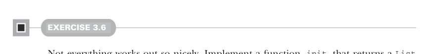

# Страница 0072
[<- Страница 0071](./page-0071) | [Индекс страниц](./) | [Страница 0073 ->](./page-0073)

> Часть 1: Введение в функциональное программирование / Глава 3: Функциональные структуры данных / 3.3 Общий доступ к данным в функциональных структурах данных / 3.3.2 Рекурсия по спискам и обобщение до высших функций

## 43 3.3 Общий доступ к данным в функциональных структурах данных



#### УПРАЖНЕНИЕ 3.6

Не всё в этой жизни медовый месяц, бля. Реализуй функцию ``init``, которая возвращает ``List`` со всеми элементами, кроме последнего из данного ``List``. Так, для ``List(1,2,3,4)`` вызов ``init`` вернёт ``List(1,2,3)``. Почему эту хрень нельзя сделать за константное время (время выполнения, пропорциональное размеру списка), как ``tail``?

```scala
def init[A](as: List[A]): List[A]
```

Из-за этой односвязной структуры списка, как цепь на якоре в шторм, — каждый раз, когда хочешь подменить ``tail`` у ``Cons``, даже если это последний ``Cons`` в цепочке, приходится копировать все предыдущие ``Cons``-объекты заново. Писать чисто функциональные структуры данных, чтоб они тянули разные операции без лагов, — это чисто про хитрые трюки с data sharing, чтоб не плодить сущностей сверх меры. Мы тут не будем копать в эти дебри; пока сойдёт и то, что другие уже накатали. В станддартной либе Scala, к примеру, есть чисто функциональная ``Vector`` (доки глянь тут: http://mng.bz/aZqm) — с константным рандом-акцессом, апдейтами, ``head``, ``tail``, ``init`` и добавлением в начало или конец почти за O(1), как по маслу.

### 3.3.2 Рекурсия по спискам и обобщение до высших функций

Давай ещё раз глянем на ``sum`` и ``product``. ``product`` слегка упростили, выкинув short-circuiting-чек на ``0.0``:

```scala
def sum(ints: List[Int]): Int = ints match
case Nil => 0
case Cons(x, xs) => x + sum(xs)
def product(ds: List[Double]): Double = ds match
case Nil => 1.0
case Cons(x, xs) => x * product(xs)
```

Видите, насколько они близнецы-братья? Типы разные (``List[Int]`` против ``List[Double]``), но остальное — копипаста: базовое значение для пустого списка (``0`` для sum и ``1.0`` для ``product``) и операция для склейки (``+`` для ``sum`` и ``*`` для ``product``). Как только такая дублировка вылазит, как таракан из-под плинтуса, — обобщай в высшие функции, вытаскивая подвыражения в аргументы. Если подвыражение жрёт локалки (как ``+`` сосёт ``x`` и ``xs`` из паттерна, и то же с ``product``), — сделай из неё функцию, которая эти переменные хапнет как параметры. Давай прямо сейчас это провернём. Наша функция

[<- Страница 0071](./page-0071) | [Индекс страниц](./) | [Страница 0073 ->](./page-0073)
