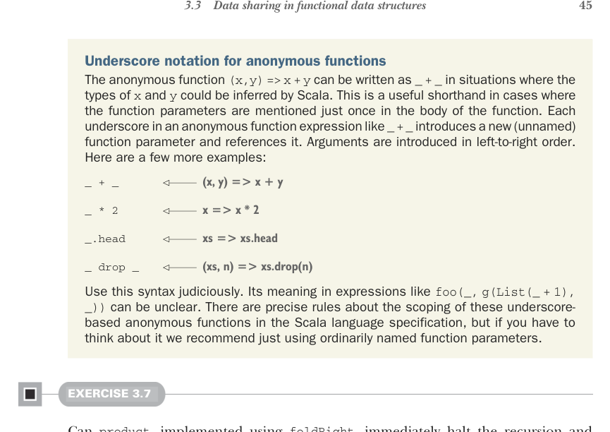

# Страница 0074
[<- Страница 0073](./page-0073) | [Индекс страниц](./) | [Страница 0075 ->](./page-0075)

> Часть 1: Введение в функциональное программирование / Глава 3: Функциональные структуры данных / 3.3 Общий доступ к данным в функциональных структурах данных / 3.3.2 Рекурсия по спискам и обобщение до высших функций



## 45 3.3 Общий доступ к данным в функциональных структурах данных

Подчёркивание для анонимных функций. Эта анонимка `(x, y) => x + y` может сжаться в `_ + _`, если Scala сам выведет типы `x` и `y`. Полезная ленивая хрень, когда каждый параметр мелькает ровно раз в теле — не еби мозги именами. Каждый `_` в такой конструкции `_ + _` тянет за собой нового безымянного пацана и ссылается на него. Аргументы лепятся слева направо. Вот ещё парочка примеров:

> (x, y) => x + y

```scala
_ + _
```

> x => x * 2

```scala
_ * 2
```

> xs => xs.head

```scala
_.head
```

> (xs, n) => xs.drop(n)

```scala
_ drop _
```

Используй эту фишку с мозгами, пацаны. В монстрах вроде `foo(_, g(List(_ + 1), _))` она может ввести в ступор даже видавшего виды кота. В спецификации Scala есть строгие правила по скоупингу этих подчёркивательных анонимок, но если сидишь и чешешь репу — лучше обычные именованные параметры, чтоб не гадать, как в пьяной рулетке.

#### УПРАЖНЕНИЕ 3.7

Может ли `product`, слепленный на `foldRight`, как только наткнётся на `0.0`, сразу сказать «пиздец, стопор» и свалить с `0.0`, не ковыряя хвост дальше? Почему хуй там? Подумайте, как любое короткое замыкание сработает на жирном списке в `foldRight`. Это глубокая подстава, к которой вернёмся в пятой главе, когда копнём в асинхронку и ленивость.


#### УПРАЖНЕНИЕ 3.8

Посмотрите, что выкинет `foldRight`, если засунуть ему самого себя `Nil` и `Cons`, типа: `foldRight(List(1, 2, 3), Nil: List[Int], Cons(_, _))`.<sup>8</sup> Что это, по-вашему, плетёт про связь `foldRight` с конструкторами `List`?

<sup>8</sup> Аннотация типа `Nil: List[Int]` тут в самый раз, иначе Scala выведет параметр `B` в `foldRight` как `List[Nothing]`, и привет, типовая яма.

[<- Страница 0073](./page-0073) | [Индекс страниц](./) | [Страница 0075 ->](./page-0075)
