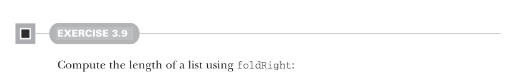

# Страница 0075

[<- Страница 0074](./page-0074) | [Оглавление страниц](./) | [Страница 0076 ->](./page-0076)

> Часть 1: Введение в функциональное программирование / Глава 3: Функциональные структуры данных / 3.3 Общий доступ к данным в функциональных структурах данных / 3.3.2 Рекурсия по спискам и обобщение до высших функций



#### УПРАЖНЕНИЕ 3.9

Посчитай длину списка через `foldRight`, пацаны, без лишней хуйни:


```scala
def length[A](as: List[A]): Int
```

#### УПРАЖНЕНИЕ 3.10

Наша реализация `foldRight` не хвостово-рекурсивная (tail-recursive) и на больших списках кинет `StackOverflowError` 
(для больших списков мы говорим, что это не *stack-safe* — небезопасно для стека). 
Убедись сам, что это так, и тогда напиши ещё одну общую функцию рекурсии по списку, `foldLeft`, 
которая хвостово-рекурсивная, используя техники из прошлой главы. 
Начинай сворачивать с левого конца списка. Вот сигнатура:⁹


```scala
def foldLeft[A, B](as: List[A], acc: B, f: (B, A) => B): B
```

#### УПРАЖНЕНИЕ 3.11

Напиши `sum`, `product` и функцию для подсчёта длины списка через `foldLeft`. Не еби мозги, просто сделай чисто.

#### УПРАЖНЕНИЕ 3.12

Напиши функцию, которая ревертит список (ну, типа из `List(1,2,3)` делает `List(3,2,1)`). 
Попробуй через fold, авось выйдет без рекурсивного ада.


#### УПРАЖНЕНИЕ 3.13

*Хардкор*: Можно ли `foldRight` выразить через `foldLeft`? А наоборот? 
Реализация `foldRight` через `foldLeft` — это годнота, потому что позволяет делать `foldRight` хвостово-рекурсивно, 
и стек не переполнится даже на огромных списках, как в продакшене бывает.

⁹ Опять же, `foldLeft` в стандартной либе Scala — метод `List`, и закаррирована для лучшей инференции типов, 
так что пишешь `mylist.foldLeft(0.0)(_ + _)` без гемора.

[<- Страница 0074](./page-0074) | [Оглавление страниц](./) | [Страница 0076 ->](./page-0076)
