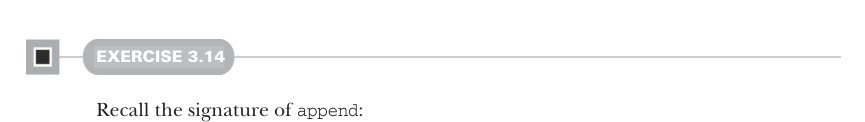

# Страница 0076

[<- Страница 0075](./page-0075) | [Индекс страниц](./) | [Страница 0077 ->](./page-0077)

> Часть 1: Введение в функциональное программирование / Глава 3: Функциональные структуры данных / 3.3 Общий доступ к данным в функциональных структурах данных / 3.3.3 Ещё функции для работы со списками

## 47 3.3 Общий доступ к данным в функциональных структурах данных



#### УПРАЖНЕНИЕ 3.14

Вспомни сигнатуру `append`:

```scala
def append[A](a1: List[A], a2: List[A]): List[A]
```

Реализуй `append` через `foldLeft` или `foldRight`, а не через структурную рекурсию, чтоб не ебаться с хвостовой хуйнёй вручную.


#### УПРАЖНЕНИЕ 3.15

*Сложное*: Напиши функцию, которая склеит список списков в один сплошной лист. 
Время должно быть линейным по общей длине всех этих сук, без квадратичных подвохов. 
Старайся юзать функции, которые мы уже наваяли — не изобретай велосипед заново.

### 3.3.3 Ещё функции для работы со списками

Есть ещё дохуя полезных функций для возни со списками. 
Здесь разберём парочку, чтоб набить руку на обобщении этих рекурсивных монстров и просечь типичные паттерны обработки листов — как в старом добром код-ревью, где пацаны тыкают в твою `foldLeft` и говорят "а вот тут можно map'ом". 
После этой секции не жди, что у тебя автоматически щёлкнет "о, это же flatMap!" — просто заведи привычку пялиться на свои ручные циклы по списку и думать: "А не обобщить ли эту хуйню до высшего порядка?". 
Если так ковыряться, сам переоткроешь эти функции, как я в 2008-м на Cats'ах проснулся, и разовьёшь чутьё, когда какую юзать, без мемов про "recursion detected".


#### УПРАЖНЕНИЕ 3.16

Напиши функцию, которая возьмёт список интов и прибавит `1` к каждому элементу 
(короче, из листа чисел получи новый, где каждое на единицу жирнее оригинала — классика map'а, но без подсказок).


#### УПРАЖНЕНИЕ 3.17

Напиши функцию, которая превратит каждое значение в `List[Double]` в `String`. 
Можешь юзать выражение `d.toString`, чтоб конвертнуть какой-нибудь `d: Double` в `String` — как `toString` на стероидах.

[<- Страница 0075](./page-0075) | [Индекс страниц](./) | [Страница 0077 ->](./page-0077)
