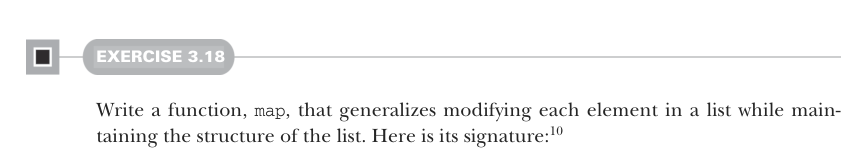
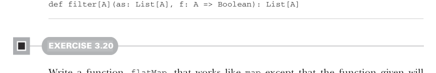
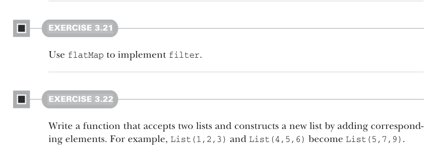

# Страница 0077
[<- Страница 0076](./page-0076) | [Индекс страниц](./) | [Страница 0078 ->](./page-0078)

> Часть 1: Введение в функциональное программирование / Глава 3: Функциональные структуры данных / 3.3 Общий доступ к данным в функциональных структурах данных / 3.3.3 Ещё функции для работы со списками



#### УПРАЖНЕНИЕ 3.18

Слепите функцию `map`, которая обобщает изменение каждого элемента в списке, сохраняя при этом его структуру — как твой старый цикл `for`, только без мутабельного дерьма и побочек. Вот сигнатура:10


```scala
def map[A, B](as: List[A], f: A => B): List[B]
```

#### УПРАЖНЕНИЕ 3.19

Напишите функцию `filter`, которая выкидывает из списка элементы, не прошедшие заданный предикат — чистильщик, как вышибала в клубе, пропускает только вип по твоему правилу. Примените её, чтоб вымести все нечётные числа из `List[Int]`:



```scala
def filter[A](as: List[A], f: A => Boolean): List[A]
```

#### УПРАЖНЕНИЕ 3.20

Смастерите функцию `flatMap`, которая работает как `map`, но с подвохом: твоя функция возвращает не одно значение, а целый список, и этот список вставляется прямо в финальный результирующий — никаких вложенных списков, всё расплющивается в один плоский. Сигнатура вот:11

```scala
def flatMap[A, B](as: List[A], f: A => List[B]): List[B]
```

Например, `flatMap(List(1,` `2,` `3),` `i` `=>` `List(i,i))` должно дать `List(1,` `1,` `2,` `2,` `3,` `3)` — как если `map` наделал пачек бабла, а `flatMap` их все в один кошелёк скинул.



#### УПРАЖНЕНИЕ 3.21

Используйте `flatMap`, чтоб реализовать `filter` — классический трюк, чтоб понять, как flatMap может фильтровать без фильтра.

#### УПРАЖНЕНИЕ 3.22

Напишите функцию, которая жрёт два списка и лепит новый, складывая соответствующие элементы — зип с арифметикой, чтоб не бегать в цикле как лох. Например, `List(1,2,3)` и `List(4,5,6)` станут `List(5,7,9)`.

10В стандартной либе `map` — это метод на `List`, но мы сами ковыряем консList, чтоб понять под капотом. 11Там же `flatMap` — метод на `List`, монстр для плоских трансформаций.

[<- Страница 0076](./page-0076) | [Индекс страниц](./) | [Страница 0078 ->](./page-0078)
